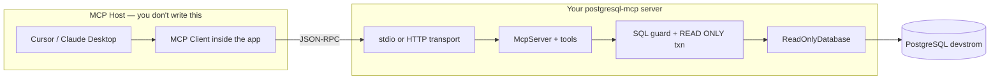

# Building Our PostgreSQL MCP — Recipe & Deep Dive

A practical guide to what we built in [postgresql-mcp](https://github.com/vallaksa/postgresql-mcp), what is open SDK vs custom code, and how to build a similar server yourself.

**Prerequisite:** [MCP Zero-to-Hero](zero_to_hero.md) — protocol concepts and architecture.

**Deployment:** [Production deploy walkthrough](deploying-postgresql-mcp-prod.md) — what we actually ran on saiserver.  
**Operations:** [PostgreSQL MCP Runbook](../../infraRunbook/postgres-mcp.md) — Docker, Tailscale, troubleshooting.

---

## 1. What Did We Build?

We built a **custom MCP server** that gives AI agents read-only access to our Postgres `devstrom` database. It is not a downloaded product — it is our code, using open libraries to implement the open MCP standard.

| Layer | What it is | Open or custom? |
|-------|------------|-----------------|
| **MCP protocol** | Standard for AI ↔ tools (JSON-RPC) | Open standard — [modelcontextprotocol.io](https://modelcontextprotocol.io) |
| **MCP TypeScript SDK** | Protocol wiring, transports, schema | Open — `@modelcontextprotocol/sdk` |
| **PostgreSQL driver** | Connect and run SQL | Open — `pg` |
| **Schema validation** | Tool input types | Open — `zod` |
| **Server logic** | Tools, safety, auth, Docker | **Custom — our code** |

We did **not** use `@modelcontextprotocol/server-postgres` (deprecated community server). We built our own with stricter read-only safety and dual transports (stdio + HTTP).

---

## 2. Architecture



**You only build the server box.** Cursor provides Host + Client.

---

## 3. Dependencies (3 runtime packages)

```json
{
  "@modelcontextprotocol/sdk": "^1.29.0",
  "pg": "^8.13.0",
  "zod": "^3.24.0"
}
```

### `@modelcontextprotocol/sdk` — official MCP framework

Provides:
- `McpServer` — register tools, resources, prompts
- `StdioServerTransport` — local stdin/stdout communication
- `StreamableHTTPServerTransport` — remote HTTP communication
- JSON-RPC handling (`tools/list`, `tools/call`, `initialize`, etc.)
- Zod → JSON Schema conversion for tool discovery

You still write the tool handlers (what happens when the AI calls `query`).

### `pg` — Node.js PostgreSQL driver

Standard connection pool and query execution. Same library any Node app uses.

### `zod` — input validation

Defines tool parameters. The SDK exposes them to the AI as JSON Schema.

---

## 4. Project Structure (what each file does)

```
postgresql-mcp/
├── src/
│   ├── index.ts          # Entrypoint — pick stdio or HTTP, load config
│   ├── createServer.ts   # Register tools + resources (MCP surface area)
│   ├── db.ts             # ReadOnlyDatabase — pool, queries, list/describe
│   ├── sql.ts            # SQL safety guard + row limit helpers
│   ├── stdio.ts          # Wire SDK stdio transport
│   ├── http.ts           # Wire SDK HTTP transport + Bearer auth + /health
│   └── config.ts         # Transport mode, port, API key validation
├── scripts/
│   ├── start.sh          # Launch script (stdio or http)
│   └── setup_readonly_user.sql  # Postgres mcp_reader user
├── Dockerfile            # Production image (HTTP mode)
└── package.json
```

| File | Custom responsibility |
|------|---------------------|
| `createServer.ts` | Define `query`, `list_tables`, `describe_table` tools + `table-schema` resource |
| `db.ts` | Connection pool, `BEGIN READ ONLY` transactions, metadata queries |
| `sql.ts` | Block `INSERT`/`DELETE`/DDL; clamp row limits |
| `stdio.ts` | Connect `McpServer` to stdin/stdout |
| `http.ts` | Express app, `/mcp` endpoint, Bearer auth, `/health` |
| `config.ts` | Resolve `MCP_TRANSPORT`, `MCP_API_KEY`, host/port |
| `index.ts` | Glue — create DB pool, route to transport, graceful shutdown |

---

## 5. MCP Surface Area (what the AI sees)

### Tools (actions the AI can call)

| Tool | Input | What it does |
|------|-------|--------------|
| `query` | `sql`, optional `limit` | Run read-only SQL, return JSON rows |
| `list_tables` | optional `schema` | List base tables in a schema |
| `describe_table` | `table`, optional `schema` | Column names, types, nullability, defaults |

### Resources (read-only data the AI can browse)

| Resource | URI pattern | Content |
|----------|-------------|---------|
| `table-schema` | `postgres://host/db/{table}/schema` | JSON column metadata per table |

Registered in `createServer.ts`:

```typescript
server.registerTool("query", { inputSchema: { sql: z.string(), ... } }, async ({ sql }) => {
  const result = await db.queryReadOnly(sql);
  return { content: [{ type: "text", text: JSON.stringify(result) }] };
});
```

---

## 6. Safety Layers (why we built custom)

Generic MCP Postgres servers often allow full SQL. Ours is deliberately restricted:

| Layer | Where | What it does |
|-------|-------|--------------|
| **SQL keyword guard** | `sql.ts` | Rejects `INSERT`, `UPDATE`, `DELETE`, `DROP`, `ALTER`, etc. |
| **Read-only transaction** | `db.ts` | `BEGIN TRANSACTION READ ONLY` on every query |
| **Database user** | `setup_readonly_user.sql` | `mcp_reader` has `SELECT` only — not superuser |
| **Row cap** | `db.ts` + `sql.ts` | Wraps queries in `LIMIT N` (default 100, max 1000) |
| **HTTP API key** | `http.ts` | `Authorization: Bearer <MCP_API_KEY>` for remote access |

```typescript
// sql.ts — block dangerous keywords
const FORBIDDEN = /\b(INSERT|UPDATE|DELETE|DROP|ALTER|...)\b/i;

// db.ts — Postgres enforces read-only at transaction level
await client.query("BEGIN TRANSACTION READ ONLY");
const result = await client.query(sql);
await client.query("ROLLBACK");
```

---

## 7. Request Flow (what happens when you ask "list tables")

**Step 1 — Client discovers tools:**

```json
{ "jsonrpc": "2.0", "method": "tools/list", "id": 1 }
```

**Step 2 — SDK responds** (from your `registerTool` calls):

```json
{
  "tools": [
    { "name": "query", "description": "Run a read-only SQL query..." },
    { "name": "list_tables", "description": "List base tables..." },
    { "name": "describe_table", "description": "Describe columns..." }
  ]
}
```

**Step 3 — AI calls a tool:**

```json
{
  "method": "tools/call",
  "params": { "name": "list_tables", "arguments": { "schema": "public" } }
}
```

**Step 4 — Your handler runs** (`createServer.ts` → `db.ts`):

```sql
SELECT table_name FROM information_schema.tables
WHERE table_schema = 'public' AND table_type = 'BASE TABLE'
ORDER BY table_name
```

**Step 5 — Result returns to the AI:**

```json
{ "content": [{ "type": "text", "text": "[\"runs\"]" }] }
```

You never wrote JSON-RPC parsing — the SDK handles that. You only wrote step 4.

---

## 8. Two Transports

| Mode | SDK class | When | How client connects |
|------|-----------|------|---------------------|
| **stdio** | `StdioServerTransport` | Local dev | `command: node dist/index.js` in `mcp.json` |
| **HTTP** | `StreamableHTTPServerTransport` | Hosted on server | `url: https://server/mcp` in `mcp.json` |

Same tools, same server logic — only the wire changes.

**stdio:**
```
Cursor spawns → node dist/index.js
       ↕ stdin/stdout (JSON-RPC)
Your MCP server → PostgreSQL
```

**HTTP:**
```
Cursor → HTTPS POST https://server/mcp
       → Express (http.ts) → StreamableHTTPServerTransport
       → Same McpServer + tools → PostgreSQL
```

---

## 9. Recipe — Build Your Own MCP Server

Use this recipe for any external system (another database, an API, a file store).

### Step 1 — Scaffold

```bash
mkdir my-mcp && cd my-mcp
npm init -y
npm install @modelcontextprotocol/sdk zod
npm install -D typescript tsx vitest @types/node
```

Add to `package.json`:

```json
{
  "type": "module",
  "scripts": {
    "build": "tsc",
    "dev": "tsx src/index.ts",
    "start": "node dist/index.js",
    "test": "vitest run"
  }
}
```

Create `tsconfig.json` with `"module": "NodeNext"`, `"outDir": "dist"`.

### Step 2 — Define tools

```typescript
// src/createServer.ts
import { McpServer } from "@modelcontextprotocol/sdk/server/mcp.js";
import { z } from "zod";

export function createServer() {
  const server = new McpServer({ name: "my-mcp", version: "1.0.0" });

  server.registerTool(
    "my_action",
    {
      description: "What this tool does — the AI reads this to decide when to call it",
      inputSchema: {
        param: z.string().describe("What the param means"),
      },
    },
    async ({ param }) => {
      const result = await doSomething(param); // YOUR business logic
      return {
        content: [{ type: "text", text: JSON.stringify(result, null, 2) }],
      };
    },
  );

  return server;
}
```

### Step 3 — Wire stdio transport

```typescript
// src/index.ts
import { StdioServerTransport } from "@modelcontextprotocol/sdk/server/stdio.js";
import { createServer } from "./createServer.js";

const server = createServer();
const transport = new StdioServerTransport();
await server.connect(transport);
```

### Step 4 — Connect to Cursor

`.cursor/mcp.json`:

```json
{
  "mcpServers": {
    "my-mcp": {
      "command": "node",
      "args": ["/absolute/path/to/my-mcp/dist/index.js"],
      "env": {
        "MY_SECRET": "value-if-needed"
      }
    }
  }
}
```

### Step 5 — Build and test

```bash
npm run build
# Refresh MCP in Cursor → Settings → MCP
# Ask the AI: "use my_action with param hello"
```

### Step 6 — Add HTTP transport (optional, for hosting)

Copy the pattern from `postgresql-mcp/src/http.ts`:
- `createMcpExpressApp()` from the SDK
- `StreamableHTTPServerTransport` on `POST /mcp`
- Bearer auth middleware
- `/health` endpoint for Docker

### Step 7 — Add safety (recommended for production)

- Validate all inputs
- Use least-privilege credentials (read-only DB user, scoped API tokens)
- Rate limit if exposed over HTTP
- Never put secrets in client config — server-side env only

---

## 10. Adapting This Recipe for Other Systems

| Target | Replace `db.ts` with | Example tools |
|--------|---------------------|---------------|
| **Redis** | `ioredis` client | `get_key`, `list_keys`, `get_info` |
| **REST API** | `fetch` wrapper | `get_user`, `search_orders` |
| **File system** | `fs/promises` | `read_file`, `list_directory` |
| **Your data-provider** | HTTP client to your API | `get_run`, `search_chunks` |

The MCP SDK layer stays the same. Only the tool handlers and safety rules change.

---

## 11. Mental Model

```
┌─────────────────────────────────────┐
│  MCP Protocol (open standard)       │  JSON-RPC: tools/list, tools/call
├─────────────────────────────────────┤
│  @modelcontextprotocol/sdk (open)   │  Transports, schemas, protocol
├─────────────────────────────────────┤
│  YOUR CODE (custom)                 │  Tools, safety, auth, deployment
│  + domain driver (pg, fetch, etc.)  │  Talks to the external system
└─────────────────────────────────────┘
```

**The SDK is plumbing. Your value is:**
1. What tools you expose
2. What safety rules you enforce
3. How you deploy and secure it

---

## 12. What We Could Have Used Instead

| Option | Status | Why we built custom |
|--------|--------|---------------------|
| `@modelcontextprotocol/server-postgres` | Deprecated | Unmaintained, no read-only guarantees |
| Supabase MCP plugin | Hosted service | We use self-hosted Postgres |
| Raw `psql` in shell | No MCP | No tool discovery, no safety, not a protocol |
| **Our `postgresql-mcp`** | Active | Full control, read-only, stdio + HTTP, our infra |

---

## Related Docs

| Doc | What it covers |
|-----|----------------|
| [MCP Zero-to-Hero](zero_to_hero.md) | Protocol concepts, architecture, JSON-RPC |
| [PostgreSQL MCP Runbook](../../infraRunbook/postgres-mcp.md) | Deploy on homelab, Tailscale, Docker, ops |
| [postgresql-mcp README](https://github.com/vallaksa/postgresql-mcp/blob/main/README.md) | Upstream repo, env vars, client config |
