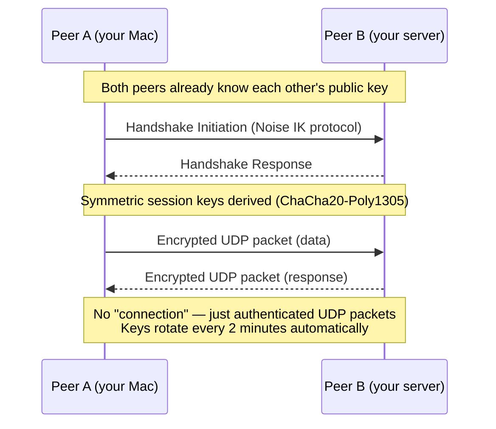
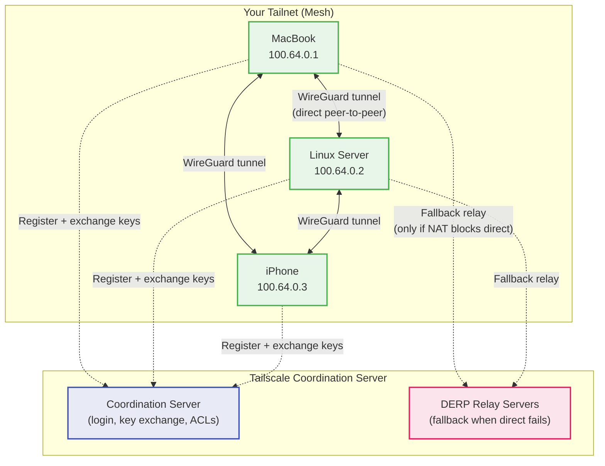
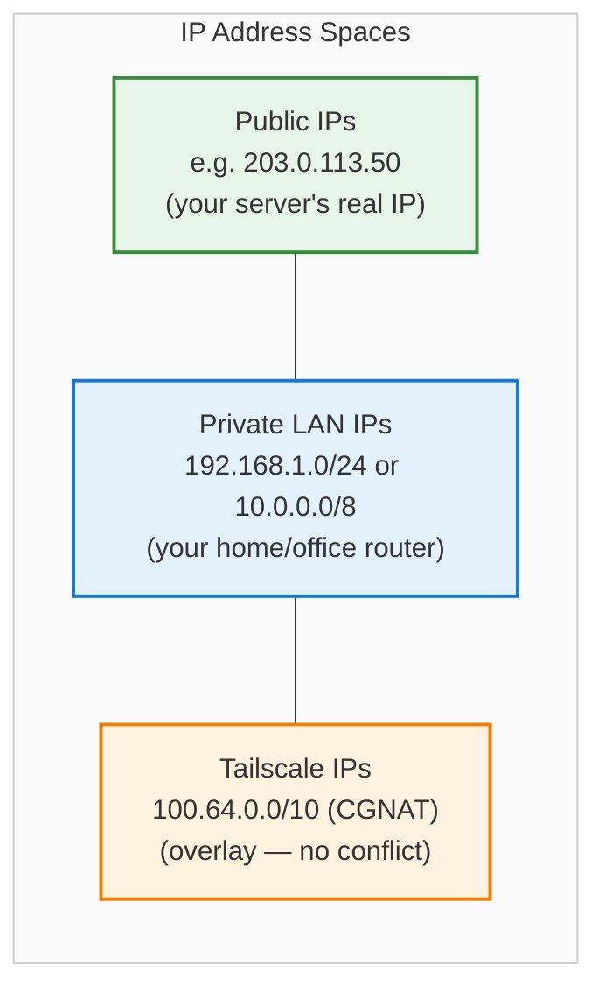
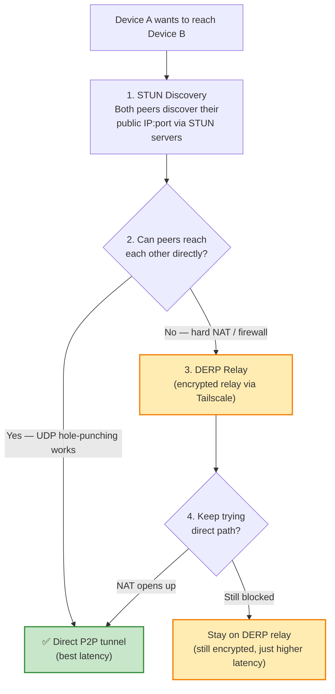
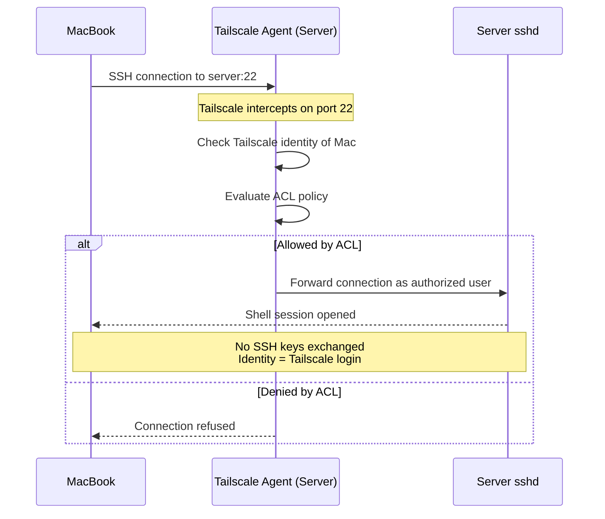
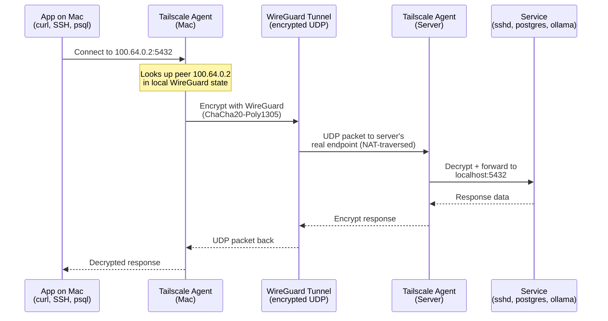
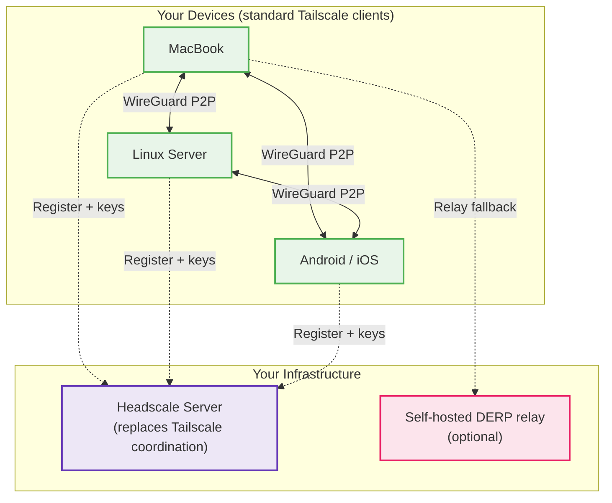

# Tailscale & WireGuard Networking

How Tailscale creates a secure, zero-config mesh VPN on top of WireGuard — and how it handles IPs, SSH, and server access.

---

## WireGuard — The Foundation

[WireGuard](https://www.wireguard.com/) is a modern, in-kernel VPN protocol. Tailscale is built entirely on top of it.

### Why WireGuard Matters

| Property | WireGuard | OpenVPN / IPSec |
|---|---|---|
| **Codebase** | ~4,000 lines of C | 100,000+ lines |
| **Crypto** | ChaCha20, Poly1305, Curve25519, BLAKE2s | Negotiable (TLS stack) |
| **Performance** | Kernel-space, near line-speed | User-space, higher overhead |
| **Attack surface** | Minimal — single cipher suite | Large — cipher negotiation |
| **Handshake** | 1-RTT Noise IK | Multi-round TLS |
| **State** | Stateless — no "connection" to drop | Stateful tunnels |

### WireGuard Tunnel — How It Works



### Key Concept: Cryptokey Routing

WireGuard doesn't use traditional routing tables. Each peer has an **AllowedIPs** list — a mapping of which IP ranges should be sent through that peer's tunnel.

```ini
# /etc/wireguard/wg0.conf (manual WireGuard example)
[Interface]
PrivateKey = <your-private-key>
Address = 10.0.0.1/24
ListenPort = 51820

[Peer]
PublicKey = <server-public-key>
Endpoint = 203.0.113.50:51820
AllowedIPs = 10.0.0.2/32          # Only this peer's VPN IP
PersistentKeepalive = 25
```

> **📝 Note:** With raw WireGuard, you manage keys, configs, and firewall rules on every peer manually. This is exactly the problem Tailscale solves.

---

## Tailscale — The Orchestration Layer

Tailscale wraps WireGuard and automates everything: key exchange, NAT traversal, peer discovery, and access control. You get a **mesh VPN** where every device talks directly to every other device.

### Architecture



### What Tailscale Does vs. What WireGuard Does

| Responsibility | WireGuard | Tailscale |
|---|---|---|
| Encryption | ✅ Handles all crypto | Delegates to WireGuard |
| Key generation | ✅ Generates keypairs | Automates + distributes |
| Key distribution | ❌ Manual | ✅ Via coordination server |
| NAT traversal | ❌ Not built-in | ✅ STUN/ICE + DERP relay |
| Peer discovery | ❌ Manual endpoints | ✅ Automatic |
| Access control | ❌ AllowedIPs only | ✅ ACL policies (JSON) |
| DNS / MagicDNS | ❌ Not included | ✅ `hostname.tailnet-name.ts.net` |
| SSH access | ❌ Configure yourself | ✅ Tailscale SSH (identity-based) |

---

## IP Addressing — The 100.x.y.z Range

Tailscale assigns each device a **stable IP** from the CGNAT range `100.64.0.0/10`. This range is reserved by IANA and doesn't collide with typical LAN subnets (`192.168.x.x`, `10.x.x.x`).



### Your Tailnet Example

| Device | Tailscale IP | MagicDNS Name | Physical Location |
|---|---|---|---|
| MacBook | `100.64.0.1` | `macbook.tailnet-abc.ts.net` | Home (behind NAT) |
| Linux Server | `100.64.0.2` | `server.tailnet-abc.ts.net` | Data center (public IP) |
| iPhone | `100.64.0.3` | `iphone.tailnet-abc.ts.net` | Coffee shop Wi-Fi |

> **💡 Tip:** Tailscale IPs are **stable** — they don't change when you switch networks, reboot, or travel. This is what makes SSH and service connections reliable.

---

## NAT Traversal — How Direct Connections Happen

Most devices sit behind NAT (home routers, corporate firewalls). Tailscale uses multiple strategies to establish **direct** peer-to-peer WireGuard tunnels:



### Check Your Connection Type

```bash
# See the status of all peers (direct vs relayed)
tailscale status

# Detailed peer info — shows latency, endpoints, relay
tailscale status --json | jq '.Peer[] | {name: .HostName, direct: .CurAddr, relay: .Relay}'

# Ping a peer to check latency and path
tailscale ping server
```

Typical output:
```
pong from server (100.64.0.2) via 203.0.113.50:41641 in 12ms
```
If it says `via DERP(nyc)` instead of a direct IP, traffic is being relayed.

---

## SSH Over Tailscale

### Method 1: Standard SSH Over Tailscale IP

The simplest approach — use the Tailscale IP or MagicDNS name instead of the public IP:

```bash
# Instead of:  ssh user@203.0.113.50
ssh user@100.64.0.2

# Or with MagicDNS:
ssh user@server.tailnet-abc.ts.net
```

This works because Tailscale creates a WireGuard tunnel first, and SSH rides inside it. The server's port 22 is **never exposed** to the public internet.

### Method 2: Tailscale SSH (Identity-Based, No Keys)

Tailscale SSH eliminates SSH keys entirely. Authentication is based on your Tailscale identity.

```bash
# Enable Tailscale SSH on the server
tailscale up --ssh

# From your Mac — no keys, no passwords
ssh user@server.tailnet-abc.ts.net
```



### SSH Config for Convenience

Add this to `~/.ssh/config` on your Mac:

```ssh-config
Host server
    HostName 100.64.0.2
    User vallaksa
    # No need for IdentityFile if using Tailscale SSH

Host server-dns
    HostName server.tailnet-abc.ts.net
    User vallaksa
```

Then just: `ssh server`

---

## Full Traffic Flow — Mac to Server

Putting it all together: what happens when your Mac connects to a service on your Linux server over Tailscale.



---

## Useful Commands

```bash
# Install Tailscale (Linux)
curl -fsSL https://tailscale.com/install.sh | sh

# Start and authenticate
sudo tailscale up

# Check status of all peers
tailscale status

# Check your own Tailscale IP
tailscale ip -4

# Ping another device in your tailnet
tailscale ping <hostname>

# See connection details (direct vs relay, latency)
tailscale netcheck

# Enable Tailscale SSH on a server
tailscale up --ssh

# Advertise this machine as a subnet router (expose LAN)
tailscale up --advertise-routes=192.168.1.0/24

# Accept a route advertised by another node
tailscale up --accept-routes

# Serve a local port to your tailnet (like ngrok, but private)
tailscale serve https / http://localhost:3000

# Expose to the public internet via Tailscale Funnel
tailscale funnel 443
```

---

## Headscale — Self-Hosted Coordination Server

[Headscale](https://github.com/juanfont/headscale) is an **open-source, self-hosted** replacement for Tailscale's coordination server. It implements the Tailscale control plane API, so you can use the **official Tailscale clients** while keeping full control of the coordination infrastructure.



### Headscale vs. Tailscale

| Feature | Tailscale (SaaS) | Headscale (Self-Hosted) |
|---|---|---|
| **Coordination server** | Managed by Tailscale Inc. | You host it |
| **Data plane (WireGuard)** | Peer-to-peer (your traffic) | Peer-to-peer (identical) |
| **DERP relays** | Tailscale's global network | Self-host or use Tailscale's |
| **Client software** | Official apps | Same official apps (compatible) |
| **ACLs** | JSON in Tailscale admin console | JSON/YAML in Headscale config |
| **SSO / OIDC** | Built-in | Supports OIDC providers |
| **MagicDNS** | ✅ Built-in | ✅ Supported |
| **Tailscale SSH** | ✅ | ⚠️ Partial support |
| **Funnel / Serve** | ✅ | ❌ Not supported |
| **Web admin UI** | ✅ Full dashboard | Community-built ([headscale-ui](https://github.com/gurucomputing/headscale-ui)) |
| **Pricing** | Free for personal (100 devices) | Free forever |

### Headscale Setup (Quick Start)

```bash
# 1. Download Headscale (on your server)
wget https://github.com/juanfont/headscale/releases/latest/download/headscale_linux_amd64 -O /usr/local/bin/headscale
chmod +x /usr/local/bin/headscale

# 2. Create config
mkdir -p /etc/headscale
headscale generate default-config > /etc/headscale/config.yaml

# 3. Edit config — set your server's public URL
# server_url: https://headscale.yourdomain.com:443
# listen_addr: 0.0.0.0:8080

# 4. Start Headscale
headscale serve

# 5. Create a user (namespace)
headscale users create myuser

# 6. On a client device — point to your Headscale server
tailscale up --login-server https://headscale.yourdomain.com
```

### When to Use Headscale

| Scenario | Recommendation |
|---|---|
| Personal / small team, just want it to work | **Tailscale SaaS** — zero setup, free tier is generous |
| Enterprise or regulatory (data sovereignty) | **Headscale** — full control over metadata |
| You want Funnel, Serve, or full Tailscale SSH | **Tailscale SaaS** — Headscale doesn't support these yet |
| Air-gapped / no internet (after initial setup) | **Headscale** — coordination server is on your infra |
| Learning / homelab | Either — Headscale teaches you more about the internals |

### Headscale — Cons

- **Operational overhead** — you own the coordination server's uptime, backups, and TLS certificates.
- **No Tailscale Funnel or Serve** — these features require Tailscale's infrastructure.
- **Partial Tailscale SSH support** — identity-based SSH is still being implemented.
- **No official web UI** — the community-built UI exists but isn't as polished as Tailscale's admin console.
- **Slower feature parity** — new Tailscale features land in Headscale weeks or months later, if at all.
- **Single-maintainer risk** — the project is healthy but has a smaller contributor base than Tailscale's commercial product.
- **DERP relay self-hosting is optional** — but if you don't self-host DERP, you're still relying on Tailscale's relay fallback. Fully air-gapped setups require running your own DERP servers.

---

## Related Docs

- [Docker Networking](docker-networking.md) — how containers connect on the server
- [Adding a Service](adding-a-service.md) — deploying new services that are reachable over Tailscale
- [PostgreSQL MCP](postgres-mcp.md) — expose MCP over Tailscale serve
