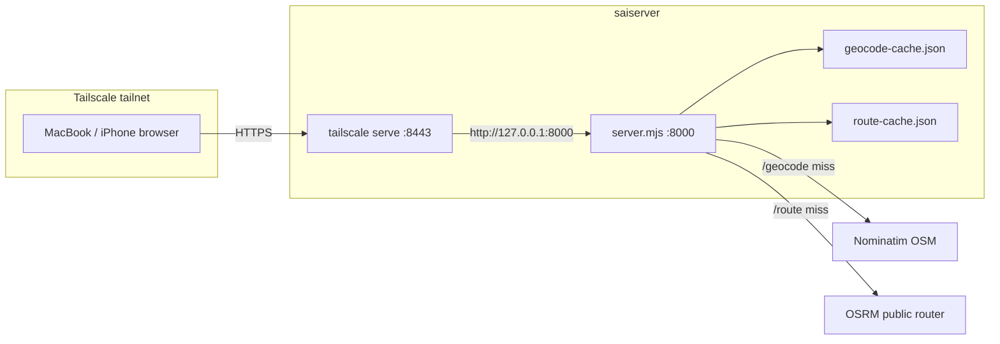

# Travel Map Intelligence — Deployment & Operations

Private Google Maps Timeline viewer with travel intelligence (trips, cities/countries, reverse geocoding) and OSRM road-route gap filling. Runs on saiserver; accessed from Mac/iPhone over Tailscale.

**Source repo:** [github.com/vallaksa/Travel-Map-Intelligence](https://github.com/vallaksa/Travel-Map-Intelligence)  
**Code on server:** `~/projects/code/gmaps-timeline-viewer/`

---

## What It Is

A static + small Node host that:

- Parses Google Timeline JSON **100% in the browser** (your location file is never uploaded)
- Shows map layers: visits, movement trace, trip lines, heatmap
- **Travel panel:** auto trip detection, countries/cities, geocoding via Nominatim
- **Compute missing routes:** fills GPS gaps with OSM road geometry via OSRM; major gaps can prompt “do you remember?” with optional waypoints

| Role | Owner |
|------|--------|
| App + geocode/route proxies | `server.mjs` on host port `8000` |
| Remote HTTPS | Tailscale serve on `:8443` |
| Personal timeline JSON | Local only — e.g. `~/projects/code/ContextData/GmapsTimeline.json` (never commit) |

---

## Architecture



### Endpoints (local)

| Path | Purpose |
|------|---------|
| `/` / `/index.html` | Viewer UI |
| `/geocode?lat=&lon=` | Cached Nominatim reverse geocode |
| `/route?fromLat=&fromLon=&toLat=&toLon=&profile=driving\|foot` | Cached OSRM road route |

Browser falls back to direct Nominatim/OSRM + IndexedDB if `server.mjs` is not used (e.g. plain `python3 -m http.server`). Prefer `server.mjs` so Mac and iPhone share one disk cache.

---

## Deploy / run on saiserver

### 1. Update code

```bash
cd ~/projects/code/gmaps-timeline-viewer
git pull origin main
```

### 2. Start the host (shared caches)

```bash
# Stop any old static server on 8000 first if needed
cd ~/projects/code/gmaps-timeline-viewer
PORT=8000 node server.mjs
```

Expected log:

```
[timeline] http://127.0.0.1:8000  (geocode: N · routes: M)
```

Caches written next to the app (gitignored):

- `geocode-cache.json`
- `route-cache.json`

### 3. Expose via Tailscale

Port **443** is already used by postgres-mcp. Use **8443** for this app:

```bash
sudo tailscale serve --bg --https=8443 http://127.0.0.1:8000
tailscale serve status
```

Open from any device on the tailnet:

```
https://sai.tailaf8d25.ts.net:8443/
```

(Root path `/` — not `/timeline`. `/timeline` on `:443` hits postgres-mcp and returns `Cannot GET /timeline`.)

Disable later:

```bash
sudo tailscale serve --https=8443 off
```

---

## Operations

### Restart after pull

```bash
# Find and stop previous node server.mjs if needed, then:
cd ~/projects/code/gmaps-timeline-viewer
git pull origin main
PORT=8000 node server.mjs
```

Tailscale serve can stay as-is if it already points at `127.0.0.1:8000`.

### Verify

```bash
curl -s -o /dev/null -w "%{http_code}\n" http://127.0.0.1:8000/index.html
curl -s "http://127.0.0.1:8000/route?fromLat=40.72&fromLon=-74.04&toLat=39.95&toLon=-75.17&profile=driving" | head -c 200
```

### User workflow (browser)

1. Drop `Timeline.json` / `location-history.json` / `GmapsTimeline.json` onto the page
2. Optional: **Resolve place names** (Nominatim)
3. Optional: uncheck **Ask me about major missing routes** for batch fill
4. **Compute missing routes** — long road gaps become cyan OSM paths; true flights stay dashed

### Flight vs road gap

- **Flight (stays dashed):** activity type `flying` / `flight`, or unrealistically fast hop (speed heuristic)
- **Road gap (fillable):** missing GPS including long multi-hour drives

---

## Security / privacy

- [ ] Timeline JSON stays on the device doing the upload — never commit to git
- [ ] Use Tailscale **serve**, not **funnel** (tailnet-only)
- [ ] Port `8000` bound for local + Tailscale proxy only (do not expose on public internet)
- [ ] Cache files may contain resolved place metadata / route geometries — keep on server, gitignored
- [ ] Public OSRM/Nominatim see only coordinates you choose to resolve (not the full history file)

---

## Troubleshooting

| Symptom | Fix |
|---------|-----|
| `Cannot GET /timeline` | You hit `:443` (MCP). Use `https://sai.tailaf8d25.ts.net:8443/` |
| Button says filled but long dashes remain | Hard-refresh; older builds treated >200 km as flights. Re-run **Compute missing routes** |
| Geocode / route slow first time | Cold cache; subsequent hits use `geocode-cache.json` / `route-cache.json` |
| No shared cache across phone + Mac | Switch from `python3 -m http.server` to `node server.mjs` |
| OSRM fails for a gap | Stays dashed; try waypoints in the recall popup or skip |

---

## Related

| Doc | Relevance |
|-----|-----------|
| [Tailscale Networking](tailscale-networking.md) | `tailscale serve`, ACLs |
| [Directory Layout](directory-layout.md) | `~/projects/code/` vs `/opt/` |
| [Adding a Service](adding-a-service.md) | General onboarding (this app is host Node, not Docker today) |
| [Travel-Map-Intelligence README](https://github.com/vallaksa/Travel-Map-Intelligence) | Upstream app |
