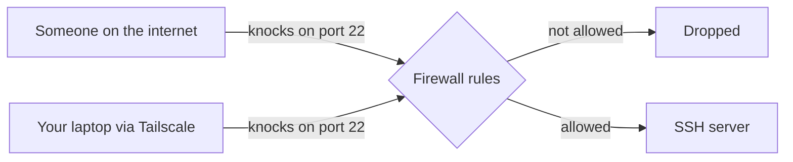
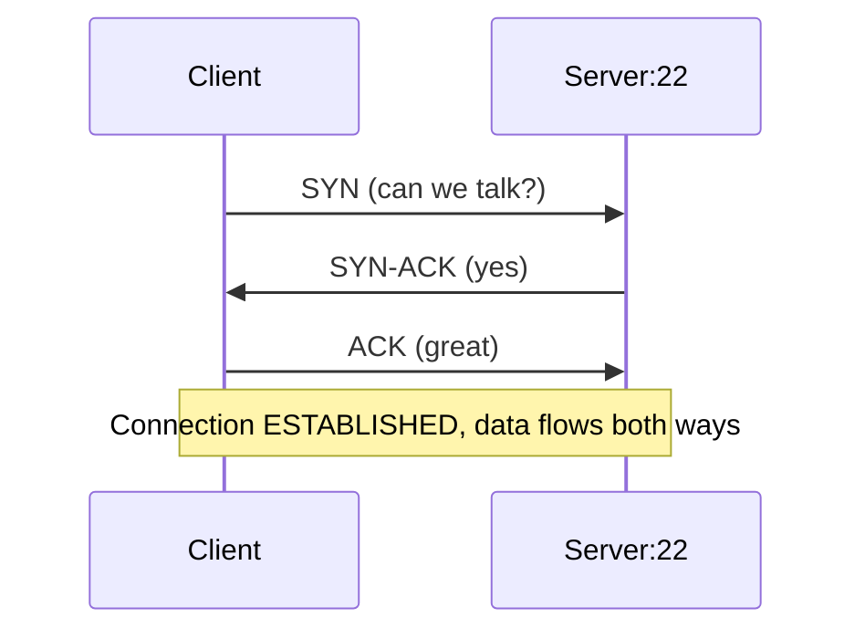
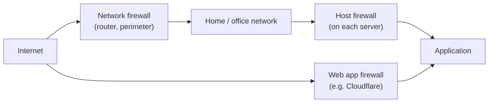
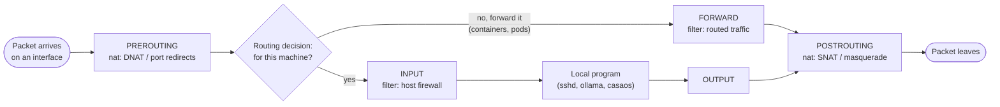
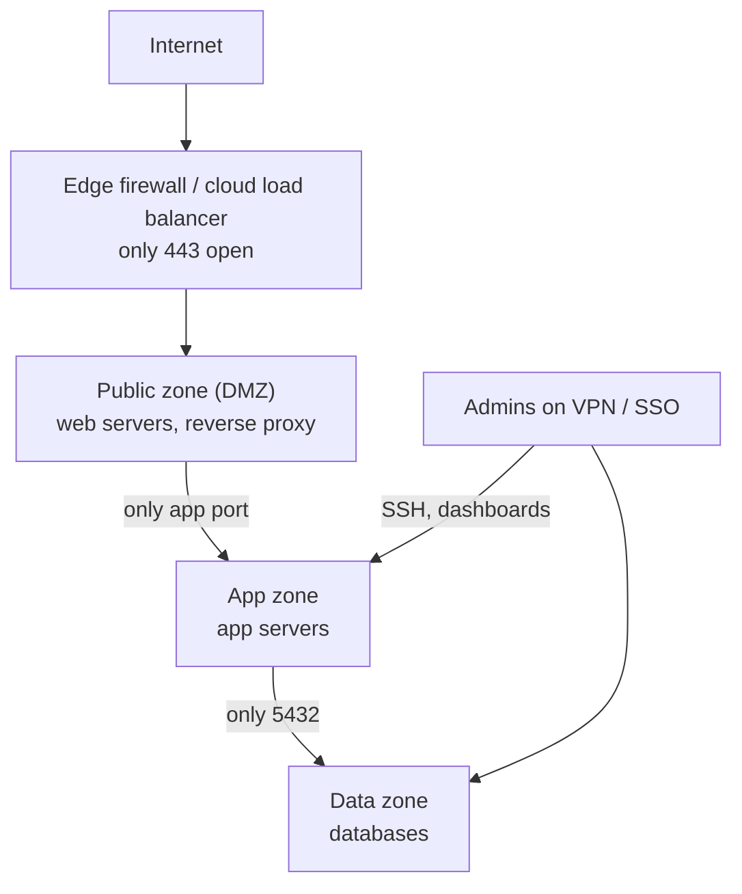
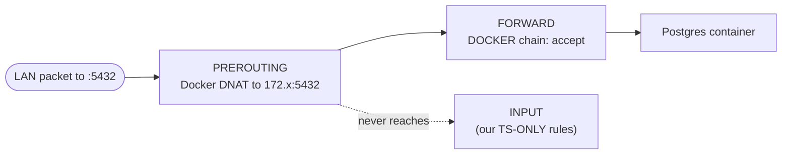
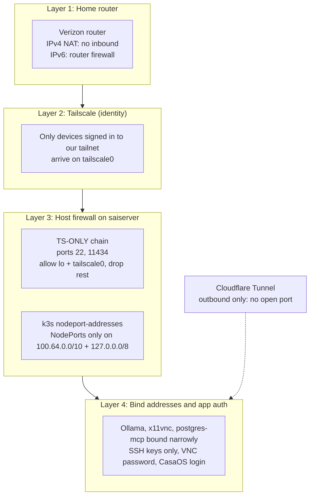
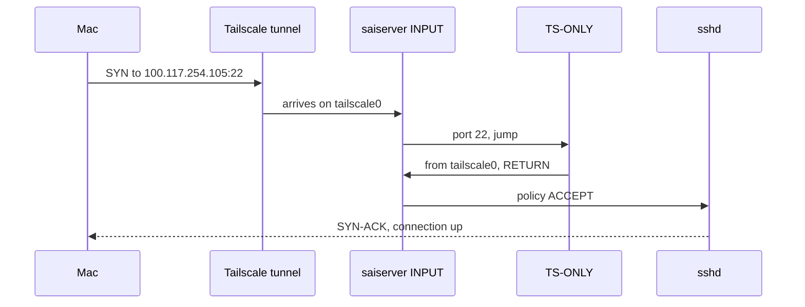
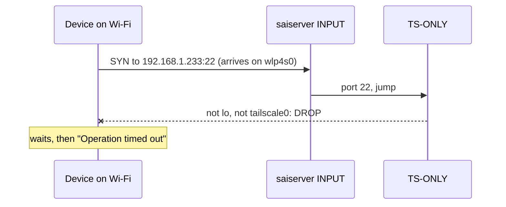
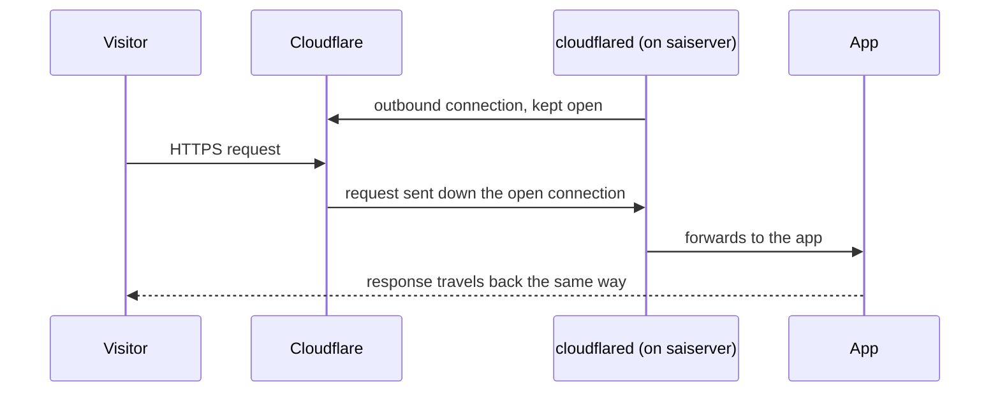

# Firewalls Explained

From first principles to how saiserver is protected.

1. [What a firewall is](#1-what-a-firewall-is)
2. [The building blocks: packets, ports, connections](#2-the-building-blocks)
3. [Kinds of firewalls](#3-kinds-of-firewalls)
4. [Core concepts every firewall shares](#4-core-concepts)
5. [How Linux does it: netfilter, iptables, nftables](#5-how-linux-does-it)
6. [How the industry configures firewalls](#6-industry-standard-practice)
7. [The nuances that catch people out](#7-the-nuances)
8. [What we do on saiserver](#8-what-we-do-on-saiserver)
9. [How we compare, and the gaps](#9-how-we-compare)
10. [Glossary](#10-glossary)

For the day-to-day commands and break-glass steps, see the runbook: [infraRunbook/firewall.md](../../infraRunbook/firewall.md).
For how packets move through the kernel, see [Packet Path: Under the Hood](packet-path-under-the-hood.md).

---

## 1. What a firewall is

A firewall is a **gatekeeper for network traffic**. Every piece of data that tries to enter (or leave) a machine or network is checked against a list of rules, and the firewall decides: let it through, or stop it.

Think of an office building:

| Building | Network |
|---|---|
| The street | The internet |
| Front gate with a guard | The router / network firewall |
| Badge readers on each office door | The host firewall on each server |
| Office numbers | Ports (22 = SSH, 80 = web, 5432 = Postgres…) |
| Staff badge | Identity (VPN / Tailscale membership, certificates) |
| "Staff only" sign | A rule: allow only if you came in through the staff entrance |

A firewall doesn't make a program secure. It decides **who is allowed to knock on the door at all**. If a service has a bug, a firewall limits who can reach that bug.



---

## 2. The building blocks

### Packets
Data travels in small chunks called **packets**. Each packet carries a header that says where it came from and where it's going. Firewalls read these headers.

```
┌──────────────────────── packet ────────────────────────┐
│ Source IP     100.118.241.69   (who sent it)           │
│ Dest IP       100.117.254.105  (who it's for)          │
│ Protocol      TCP                                      │
│ Source port   51234            (random, on the sender) │
│ Dest port     22               (the service: SSH)      │
│ ─────────────────────────────────────────────────────  │
│ Payload       ...the actual data...                    │
└────────────────────────────────────────────────────────┘
```

### IP addresses
The address of a machine on a network. Our server has several, one per network interface:

| Address | Network |
|---|---|
| `127.0.0.1` | Itself (loopback, `lo`). Never leaves the machine |
| `192.168.1.x` | Home LAN (Wi-Fi `wlp4s0` or cable `enp2s0`). Private, not routable on the internet |
| `100.x.x.x` | Tailscale (`tailscale0`). Private to our tailnet |
| `2600:…` | Public IPv6. Globally routable: the internet can address it directly |

### Ports
One machine runs many services. The **port number** says which service a packet is for. A program **listens** on a port and waits for connections.

### Protocols
- **TCP**: a conversation. It starts with a handshake, then data flows both ways. SSH, web, databases.
- **UDP**: fire-and-forget messages. DNS, video, and Tailscale's own tunnel (WireGuard).

### Connections and the TCP handshake
A TCP connection starts with three packets. Firewalls care most about the **first** one (`SYN`), because that's where "should this connection exist?" is decided.



### Inbound vs outbound
- **Inbound (ingress):** someone else starts a connection *to* you. This is what firewalls mostly guard.
- **Outbound (egress):** you start a connection *to* someone else, like `apt update` or `cloudflared` calling Cloudflare. Replies to your own outbound connections come back in, but they belong to a connection you started.

---

## 3. Kinds of firewalls



| Kind | Where it sits | What it sees | Example |
|---|---|---|---|
| **Network / perimeter** | Between networks (your router, a corporate edge box) | IPs, ports | Home router, pfSense, Fortinet |
| **Host-based** | On each machine | IPs, ports, which interface the packet arrived on | iptables/nftables, ufw, Windows Firewall |
| **Cloud security group** | Around each cloud VM, enforced by the provider | IPs, ports | AWS Security Groups, GCP firewall rules |
| **Web application firewall (WAF)** | In front of websites | Full HTTP requests (URLs, headers, bodies) | Cloudflare WAF, AWS WAF |
| **Next-gen / identity-aware** | Anywhere | Users, devices, apps, not just IPs | Palo Alto, Tailscale ACLs, Cloudflare Access |

### Stateless vs stateful

- **Stateless** firewalls judge every packet alone. To allow SSH replies you'd need a rule for the reply packets too, which is clumsy and easy to get wrong.
- **Stateful** firewalls remember connections (**connection tracking**, or *conntrack*). Once a connection is allowed, its replies are allowed automatically. Almost every modern firewall is stateful, including Linux's.

```
Connection tracking table (simplified)
┌──────────┬─────────────────────┬─────────────────────┬─────────────┐
│ proto    │ from                │ to                  │ state       │
├──────────┼─────────────────────┼─────────────────────┼─────────────┤
│ tcp      │ 100.118.241.69:51234│ 100.117.254.105:22  │ ESTABLISHED │
│ tcp      │ 192.168.1.233:40112 │ 151.101.1.1:443     │ ESTABLISHED │  ← our apt update
│ tcp      │ 192.168.1.50:61022  │ 192.168.1.233:22    │ SYN_SENT    │  ← dropped, never completes
└──────────┴─────────────────────┴─────────────────────┴─────────────┘
```

---

## 4. Core concepts

### Rules, matched top to bottom
A firewall is an ordered list. The first rule that matches decides; later rules never see the packet. **Order matters.**

```
1. allow  from tailscale0  to port 22     ← match? stop here: ALLOW
2. drop   to port 22                      ← match? stop here: DROP
3. (default policy)                       ← nothing matched
```

Swap rules 1 and 2 and nobody can SSH in at all.

### Default policy: deny vs allow
What happens when **no** rule matches.

| | Default deny ("allowlist") | Default allow ("denylist") |
|---|---|---|
| Idea | Everything is blocked unless a rule allows it | Everything is allowed unless a rule blocks it |
| New service starts listening | **Blocked** until you open it | **Exposed** until you notice and block it |
| Mistakes fail… | Closed (something doesn't work, you notice) | Open (something is exposed, you don't notice) |
| Industry standard for inbound | ✅ Yes | ❌ No |

Default deny is the standard because it's safe when you forget things, and everyone forgets things.

### DROP vs REJECT
Two ways to say no:

| | DROP | REJECT |
|---|---|---|
| What the sender sees | Nothing. The attempt hangs until it times out | An immediate "connection refused" |
| Pros | Gives scanners nothing; looks like no host is there | Friendlier for legitimate users and debugging |
| What we saw | `nc: … Operation timed out` from the Mac | would have been `Connection refused` |

### Ingress, egress, and allowing replies
A standard stateful host firewall looks like this:

```
INBOUND (default: DROP)
  allow  state ESTABLISHED,RELATED       ← replies to things we started
  allow  interface lo                    ← the machine talking to itself
  allow  tcp 22 from the admin network   ← the things we choose
  drop   everything else

OUTBOUND (default: ALLOW)               ← most places allow outbound; high-security places restrict it
```

### Listening address vs firewall
Two different layers control who can reach a service:

```
         Where does the program listen?        Does the firewall let the packet in?
         ─────────────────────────────         ────────────────────────────────────
127.0.0.1:11434   → only the machine itself       (firewall barely matters)
100.x.x.x:5900    → only via Tailscale            (firewall is a second lock)
0.0.0.0:22        → every IPv4 interface          (firewall is the ONLY lock)
[::]:22 or *:22   → every interface, v4 and v6    (firewall is the ONLY lock)
```

Binding to the narrowest address and firewalling is **defense in depth**: two independent locks, so one mistake doesn't expose the service.

### NAT is not a firewall (but acts like one)
Home routers share one public IPv4 address among all your devices (**NAT**). A side effect: nobody outside can start a connection to a device inside, because the router doesn't know which device to send it to. That's why home IPv4 feels "firewalled" for free.

**IPv6 has no NAT.** Every device gets a public address. Only the router's IPv6 firewall (if enabled) stands between the internet and your server.

---

## 5. How Linux does it

### netfilter: hooks in the kernel
Linux's firewall lives in the kernel and is called **netfilter**. It has **hooks**: fixed points on a packet's path where rules run.



The key insight: **INPUT only sees traffic for programs on the host itself.** Traffic that gets redirected (DNAT) in PREROUTING to a container or pod goes through **FORWARD** instead, and never touches INPUT. This is behind two of the nuances in section 7. For a step-by-step walk through PREROUTING, and where these rules live in the kernel, see [Packet Path: Under the Hood](packet-path-under-the-hood.md).

### Tables and chains
- **Tables** group rules by job: `filter` (allow/deny), `nat` (rewrite addresses), `mangle`, `raw`.
- **Chains** are ordered rule lists. Built-in chains match the hooks (`INPUT`, `FORWARD`…). You can add your own chains and **jump** to them, like calling a function. We do this with `TS-ONLY`.

```
filter table
├── INPUT     (built-in)  ──jump──>  TS-ONLY  (ours)
├── FORWARD   (built-in)  ──jump──>  DOCKER-USER, DOCKER, KUBE-FORWARD …
└── OUTPUT    (built-in)
nat table
├── PREROUTING ──jump──> KUBE-SERVICES, DOCKER …   (port redirects)
└── POSTROUTING
```

### The tools

| Tool | What it is |
|---|---|
| **netfilter** | The kernel engine |
| **nftables** (`nft`) | The modern rule language for netfilter |
| **iptables** | The classic rule language. On Ubuntu 24.04 it's `iptables-nft`: iptables syntax, stored as nftables underneath |
| **ufw** | Ubuntu's friendly front end ("uncomplicated firewall"). Not installed here |
| **firewalld** | Red Hat's front end, zone-based |
| **conntrack** | Connection tracking table and tool |

Many programs write their own rules too: Docker, Kubernetes (kube-proxy, kube-router), and Tailscale all manage chains automatically. That's why our `INPUT` chain already had `KUBE-*` and `ts-input` rules we never wrote.

---

## 6. Industry standard practice

### The principles

| Principle | Meaning |
|---|---|
| **Default deny inbound** | Block everything, open only what's needed |
| **Least privilege** | Open a port only to the people and networks that need it, not "everyone" |
| **Defense in depth** | Several independent layers (network firewall, host firewall, bind address, app auth) |
| **Segmentation** | Split networks into zones (public, internal, admin) so one breach doesn't reach everything |
| **Zero trust** | Don't trust "inside the network". Check identity for every access (VPN/Tailscale, SSO) |
| **No public admin ports** | SSH, databases, dashboards reached only via VPN or bastion |
| **Config as code** | Rules live in git, reviewed, reproducible, applied the same way every time |
| **Logging and review** | Log drops, review rules regularly, remove what's no longer used |
| **Handle IPv6 too** | Every rule for IPv4 needs an IPv6 twin |

### What a standard setup looks like

A typical company layout:



A typical host firewall, written in three common tools:

**ufw (Ubuntu)**
```bash
ufw default deny incoming
ufw default allow outgoing
ufw allow in on tailscale0 to any port 22 proto tcp
ufw allow 443/tcp
ufw enable
```

**nftables**
```
table inet filter {
  chain input {
    type filter hook input priority 0; policy drop;
    ct state established,related accept
    iif "lo" accept
    iifname "tailscale0" tcp dport 22 accept
    tcp dport 443 accept
  }
}
```

**Cloud security group (AWS)**
```
Inbound:  443/tcp  from 0.0.0.0/0          (public web)
          22/tcp   from 10.0.0.0/8         (VPN only)
Outbound: all      to   0.0.0.0/0
```

All three say the same thing: **deny by default, allow replies and localhost, open a short list on purpose.**

### How homelabs usually do it
- Router: no port forwards, or only 443 to a reverse proxy.
- Remote access through a VPN (Tailscale, WireGuard) or a tunnel (Cloudflare Tunnel) instead of open ports.
- Host firewall: often ufw with default deny.
- Docker ports bound to `127.0.0.1` and put behind a reverse proxy.

---

## 7. The nuances

These are the things that surprise people, and most of them happened to us.

### 7.1 Docker bypasses the host firewall
When Docker publishes a port (`-p 5432:5432`), it adds a **DNAT rule in PREROUTING**. The packet is rewritten to the container's address and goes through **FORWARD**, never INPUT. So INPUT rules, and ufw, don't protect Docker ports.



**Fixes:** publish as `127.0.0.1:5432:5432` (only the host can reach it), or put rules in Docker's **`DOCKER-USER`** chain, which Docker checks first and never overwrites.

### 7.2 Kubernetes NodePorts bypass INPUT too
Same mechanism. kube-proxy DNATs NodePort traffic in PREROUTING to a pod, so an INPUT DROP rule does nothing. We hit this: the original script's NodePort rule could never have worked. **Fix:** tell kube-proxy which addresses to open NodePorts on (`nodeport-addresses`).

### 7.3 IPv6 is a separate firewall
`iptables` rules only cover IPv4. IPv6 needs `ip6tables` (or nftables' `inet` family, which covers both). A service on `[::]:22` with only IPv4 rules is wide open over IPv6, and with public IPv6 addresses, that can mean the internet.

### 7.4 Don't forget `lo`
A rule like "drop port 11434 unless it came from `tailscale0`" also drops the machine talking to itself, because that traffic arrives on `lo`. We hit this: Ollama stopped answering on `127.0.0.1`. Standard rulesets always start with `iif lo accept`.

### 7.5 Rules vanish at reboot
iptables rules live in memory. After a reboot they're gone unless something re-applies them. The common tool, `netfilter-persistent save`, saves **every** rule, including the ones Docker, k3s and Tailscale create at runtime. At boot those parts don't exist yet, the restore fails, and **nothing** loads. That's what happened here for weeks. **Fix:** re-apply only *your own* rules at boot (a small service), and let each program manage its own rules.

### 7.6 Listening on `0.0.0.0` means "every network"
Many programs default to `0.0.0.0`/`[::]`. With a default-allow firewall, that means reachable from the LAN (and maybe IPv6 internet). Check with `ss -ltn`.

### 7.7 Testing firewalls is easy to get wrong
- **Testing from the server itself** goes through `lo`, not the real interface, so the result doesn't reflect what others see.
- **Testing an address nobody holds** also times out. We tested `192.168.1.232` after the server had moved to Wi-Fi on `.233`, and the timeout proved nothing.
- **Test from another device, on the right network, at the right address.**

### 7.8 Your firewall shares the table with others
Docker, Kubernetes and Tailscale all insert rules into the same chains, sometimes at the top. Rules you add can end up above or below theirs. Using **your own chain** (like `TS-ONLY`) with a single jump keeps your rules together and easy to reason about.

---

## 8. What we do on saiserver

### The layers



### Our rules, as the kernel sees them

```
INPUT chain (policy ACCEPT)
│
├── KUBE-ROUTER-INPUT, KUBE-* …          added by k3s
├── ts-input                             added by Tailscale
└── tcp dport 22,11434  ──jump──>  TS-ONLY               ← ours
                                     ├── from lo          → RETURN (continue, allowed)
                                     ├── from tailscale0  → RETURN (continue, allowed)
                                     └── anything else    → DROP
```

Set up by [`infrastructure/cluster/firewall-block-nodeports.sh`](../../../infrastructure/cluster/firewall-block-nodeports.sh):

| File | Installed to | Job |
|---|---|---|
| `tailscale-only.service` | `/etc/systemd/system/` | Rebuilds `TS-ONLY` at every boot, IPv4 + IPv6 |
| `k3s-config.yaml` | `/etc/rancher/k3s/config.yaml` | NodePorts only on Tailscale + localhost |
| `ollama-override.conf` | `/etc/systemd/system/ollama.service.d/` | Ollama on `0.0.0.0`, refuses to start without `tailscale-only` |

### Walk-throughs

**You SSH from the Mac with `ssh sai`:**



**A device on home Wi-Fi tries SSH at `192.168.1.233`:**



**Ollama on the server calls itself (`127.0.0.1:11434`):** arrives on `lo` → `TS-ONLY` returns → allowed. This is the case PR #24 fixed.

**Someone visits a public app through Cloudflare:** no inbound connection to saiserver exists. `cloudflared` opened an **outbound** connection to Cloudflare earlier, and requests come back along it.



### Who can reach what today

| Service | Port | Listens on | Tailscale | Home LAN | Internet |
|---|---|---|---|---|---|
| SSH | 22 | all | ✅ | 🔒 TS-ONLY | 🔒 |
| Ollama | 11434 | all | ✅ | 🔒 TS-ONLY | 🔒 |
| ArgoCD, postgres-mcp, 9router | NodePorts | Tailscale + localhost | ✅ | 🔒 | 🔒 |
| x11vnc (desktop) | 5900 | Tailscale IP (+ `[::]`) | ✅ | ⚠️ IPv6 only, password | ⚠️ see 9 |
| CasaOS | 80 | all | ✅ | ✅ by choice | 🔒 router (IPv4) |
| Samba file sharing | 139, 445 | all | ✅ | ⚠️ open | ⚠️ see 9 |
| Postgres (Docker, dev-strom) | 5432 | all | ✅ | ⚠️ open (Docker bypass) | ⚠️ see 9 |
| Kubernetes API | 6443 | all | ✅ | ⚠️ open (needs certs) | ⚠️ see 9 |
| kubelet | 10250 | all | ✅ | ⚠️ open (needs auth) | ⚠️ see 9 |
| Public apps | none | n/a | via Cloudflare | via Cloudflare | via Cloudflare |

"Internet ⚠️" means reachable only if the router lets inbound IPv6 through; over IPv4 the router's NAT blocks it.

---

## 9. How we compare

### Scorecard

| Industry practice | saiserver | Notes |
|---|---|---|
| No public admin ports | ✅ | SSH, ArgoCD, dashboards only over Tailscale |
| VPN / zero-trust access | ✅ | Tailscale identity instead of open ports |
| Public apps without open ports | ✅ | Cloudflare Tunnel |
| Rules as code | ✅ | `infrastructure/cluster/`, reviewed in PRs |
| Survives reboot | ✅ | Since the `netfilter-persistent` fix |
| IPv6 covered | ✅ for 22, 11434 | `ip6tables` twin rules |
| Default deny inbound | ❌ | We run **default allow + targeted blocks** |
| Docker ports protected | ❌ | 5432 bypasses INPUT |
| Logging of drops | ❌ | Drops are silent, nothing records them |

### Our model vs the standard model

```
Standard (default deny)                 Ours today (default allow + blocks)
────────────────────────                ───────────────────────────────────
allow  established/related              KUBE-* / ts-input (automatic)
allow  lo                               ports 22,11434 → TS-ONLY → drop if not ts/lo
allow  tailscale0                       …everything else: ACCEPT
allow  LAN → 80, 139, 445  (on purpose)
drop   everything else  ◄── new ports    ◄── a new service on 0.0.0.0 is open
                            stay closed      to the LAN until someone notices
```

Our approach is safe for the ports we listed, but **every new service is exposed to the LAN by default**. The gaps in section 8 (5432, 139/445, 6443, 10250) are exactly that: nobody decided to open them; nothing closed them.

### Closing the gaps

| Gap | Standard fix |
|---|---|
| Postgres 5432 via Docker | Publish as `127.0.0.1:5432:5432` in its compose file, or add a `DOCKER-USER` rule |
| Samba 139/445 | Decide: LAN on purpose (like CasaOS), or Tailscale-only via `TS-ONLY` |
| k3s API 6443, kubelet 10250 | Add to `TS-ONLY` (kubectl on the server uses localhost, which stays allowed) |
| Default allow | Move to a **default-deny** nftables ruleset on non-Tailscale interfaces, allowing only `lo`, `tailscale0`, replies, and the LAN ports we choose |
| No drop logging | Add a rate-limited `LOG` rule before the final `DROP` |

---

## 10. Glossary

| Term | Meaning |
|---|---|
| **Packet** | A chunk of network data with a header (source, destination, ports) |
| **Port** | Number identifying a service on a machine |
| **Interface** | A network connection on the machine: `lo`, `wlp4s0`, `enp2s0`, `tailscale0` |
| **Ingress / egress** | Traffic coming in / going out |
| **Stateful** | Firewall remembers connections and allows their replies |
| **conntrack** | Linux's connection tracking table |
| **Default policy** | What happens when no rule matches |
| **DROP / REJECT** | Silently discard / refuse with an error |
| **NAT** | Rewriting addresses; lets many devices share one public IPv4 |
| **DNAT** | Rewriting the *destination*; used by Docker and Kubernetes to send traffic to containers |
| **netfilter** | The Linux kernel's packet-filtering engine |
| **iptables / nftables** | Tools that write netfilter rules |
| **Chain** | An ordered list of rules; you can jump from one chain to another |
| **INPUT / FORWARD** | Chains for traffic *to this machine* / traffic *passing through* (containers, pods) |
| **NodePort** | A Kubernetes port opened on the node itself |
| **Bind / listen address** | Which of the machine's addresses a program accepts connections on |
| **Defense in depth** | Several independent layers of protection |
| **Zero trust** | Verify identity for every access instead of trusting a network location |
| **DMZ** | A separate zone for internet-facing servers |
| **Bastion** | A single hardened entry point for admin access |
| **Tailnet** | Your private Tailscale network |
