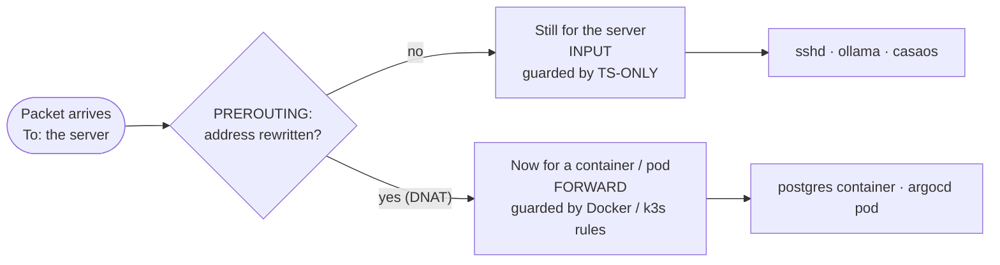
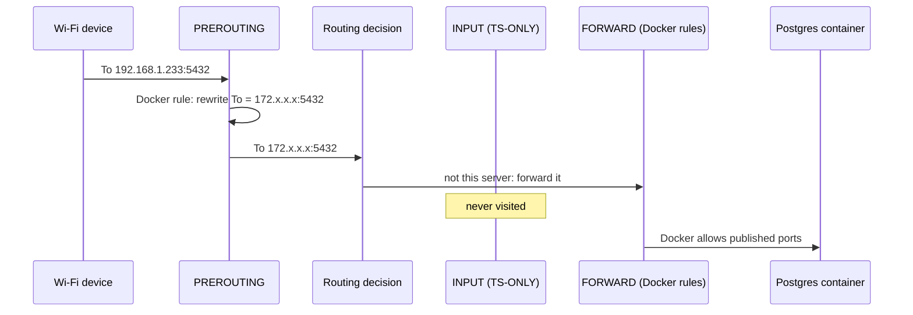
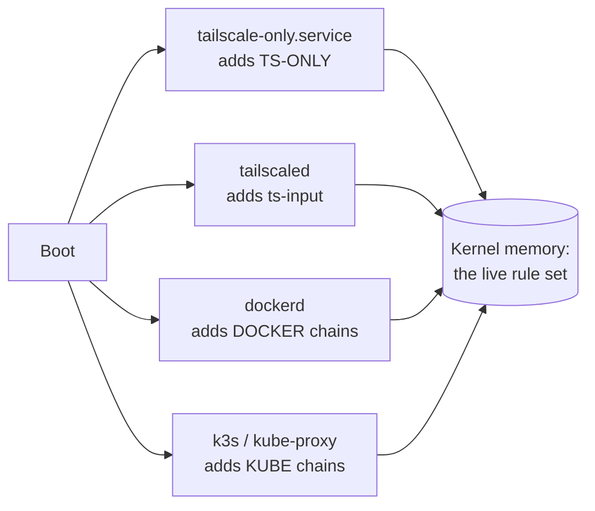
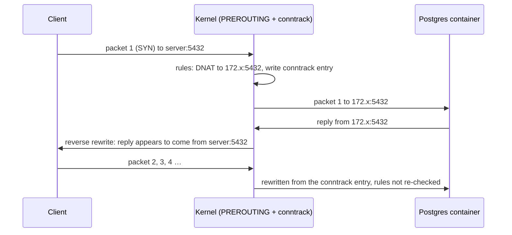

# Packet Path: Under the Hood

How a packet actually moves through saiserver, why PREROUTING decides which firewall checkpoint it faces, and where those rules really live.

Read [Firewalls Explained](firewalls-explained.md) first if terms like *port*, *INPUT* or *DNAT* are new.

1. [Containers are little machines behind the server](#1-containers-are-little-machines-behind-the-server)
2. [PREROUTING: the relabelling desk](#2-prerouting-the-relabelling-desk)
3. [Five real connections, step by step](#3-five-real-connections-step-by-step)
4. [One firewall, three paths](#4-one-firewall-three-paths)
5. [From hardware to kernel](#5-from-hardware-to-kernel)
6. [Where the rules live](#6-where-the-rules-live)
7. [From your config file to a kernel rule](#7-from-your-config-file-to-a-kernel-rule)
8. [Only the first packet is rewritten](#8-only-the-first-packet-is-rewritten)
9. [See it on the server](#9-see-it-on-the-server)

---

## 1. Containers are little machines behind the server

Docker containers and Kubernetes pods don't run as normal programs on the server. Each gets **its own IP address** on a small private network inside the server.

```
saiserver
├── Host programs (sshd, ollama, casaos)   → the server's own addresses
│                                            192.168.1.x · 100.117.254.105 · 127.0.0.1
│
└── Private internal networks
    ├── Postgres container (dev-strom)     → 172.x.x.x   (Docker's network)
    └── ArgoCD pod                         → 10.42.x.x   (Kubernetes' network)
```

So to the kernel, the server is two things at once:

1. **A computer**, running its own programs.
2. **A router**, passing traffic to the containers and pods behind it.

They're not *real* separate machines: containers share the server's kernel. That's exactly why their traffic goes through the server's firewall at all.

---

## 2. PREROUTING: the relabelling desk

Think of the server as an office building with a mailroom. Every packet is a letter, and every letter goes through the mailroom in the same order.

```
Letter arrives
     │
     ▼
┌─────────────────────────────┐
│ 1. RELABELLING DESK         │  PREROUTING
│ "Letter for port 5432?      │  Docker and k3s leave rewrite rules here.
│  Cross out the address,     │  Rewriting the destination is called DNAT.
│  write 'container 172.x'."  │
└─────────────────────────────┘
     │
     ▼
┌─────────────────────────────┐
│ 2. SORTING                  │  Routing decision
│ Read the address NOW        │  (after any rewrite)
└─────────────────────────────┘
     │                     │
     │ for this building   │ for someone behind it
     ▼                     ▼
┌──────────────┐    ┌──────────────┐
│ 3a. INPUT    │    │ 3b. FORWARD  │
│ guards host  │    │ guards pass- │
│ programs     │    │ through mail │
│ (TS-ONLY)    │    │ (Docker, k3s)│
└──────────────┘    └──────────────┘
     │                     │
     ▼                     ▼
 sshd, ollama        containers, pods
```

**The one rule to remember:**

> PREROUTING doesn't allow or block anything. It only **edits the address**. The routing decision reads the address *after* the edit, so that edit decides which checkpoint the packet faces.



---

## 3. Five real connections, step by step

Container and pod addresses (`172.x`, `10.42.x`) are examples. "Home Wi-Fi device" means any phone or laptop not using Tailscale.

| Connection | To, on arrival | After PREROUTING | Road | Checked by | Result |
|---|---|---|---|---|---|
| SSH from Mac (Tailscale) | `100.117.254.105:22` | unchanged | INPUT | TS-ONLY | ✅ allowed |
| Ollama from home Wi-Fi | `192.168.1.233:11434` | unchanged | INPUT | TS-ONLY | 🔒 dropped (timeout) |
| Postgres (Docker) from home Wi-Fi | `192.168.1.233:5432` | `172.x.x.x:5432` | FORWARD | Docker's rules | ⚠️ allowed, not on purpose |
| ArgoCD NodePort from Mac (Tailscale) | `100.117.254.105:31322` | `10.42.0.x:8080` | FORWARD | KUBE-FORWARD | ✅ allowed |
| ArgoCD NodePort from home Wi-Fi | `192.168.1.233:31322` | unchanged | INPUT | nobody listening | 🔒 connection refused |

### The Postgres case, in detail

This is the one that shows why PREROUTING matters.



1. The packet arrives addressed to the **server** (`192.168.1.233:5432`).
2. At PREROUTING, Docker's rule rewrites it to the **container** (`172.x.x.x:5432`).
3. Routing reads the new address: "not me, that's a container behind me." So: **FORWARD**.
4. FORWARD checks Docker's rules, which allow it. **INPUT never sees the packet**, so our `TS-ONLY` rule never gets a say.

### The ArgoCD-from-Wi-Fi case

k3s only creates rewrite rules for the addresses in `nodeport-addresses` (Tailscale `100.64.0.0/10` and localhost). There's no rule for the Wi-Fi address, so the packet is **not** rewritten, goes to INPUT, and finds no program listening on port 31322. The kernel answers "connection refused". The door to the pod only exists for Tailscale addresses.

---

## 4. One firewall, three paths

There's **one** kernel and **one** set of rules. Our service, Docker and k3s all write into it. Each protects a different path.

```
One building (the kernel), one security system (netfilter)

  Entrance 1: front door → host programs
              guard: TS-ONLY (ours)                         ✅

  Entrance 2: loading dock A → k3s pods
              guard: k3s only opens the dock to Tailscale   ✅
              (a k3s setting, not a firewall rule)

  Entrance 3: loading dock B → Docker containers
              guard: none of ours                           ⚠️
              (Docker's own rules allow published ports)

  Shared by all three: the relabelling desk (PREROUTING),
  the logbook (conntrack), and the master switch (iptables -F)
```

| Path | Protected by | Type |
|---|---|---|
| Host programs | `TS-ONLY` chain (ports 22, 11434) | Firewall rule we wrote |
| k3s NodePorts | `nodeport-addresses` in `/etc/rancher/k3s/config.yaml` | k3s setting: rewrite rules only exist for Tailscale + localhost |
| Docker ports | Nothing of ours | Gap. Fix: publish as `127.0.0.1:5432:5432`, or add a rule to `DOCKER-USER` |

**They are not independent.** Because they share one rule set:

- One command (`iptables -F`, or restoring a saved snapshot) can wipe all three at once.
- Docker and k3s both insert into `PREROUTING` and `FORWARD`. Order matters.
- Restarting Docker or k3s re-inserts their rules, sometimes at the top of a chain.
- All connections share one conntrack table.

---

## 5. From hardware to kernel

What physically happens when a packet reaches the server:

```
 Wi-Fi radio / network card
   │  receives the signal, turns it into bytes (a "frame")
   ▼
 DMA: the card copies the bytes straight into RAM
   │  then raises an interrupt: "new data"
   ▼
 Driver (iwlwifi for Wi-Fi, r8169 for the cable port)
   │  wraps the bytes in a kernel structure called sk_buff
   ▼
 ip_rcv()                        kernel C code: net/ipv4/ip_input.c
   │
   ├── NF_HOOK(PRE_ROUTING)      ← PREROUTING: "run every rule registered here"
   ▼
 ip_route_input()                ← the routing decision (reads the To address)
   │
   ├── for me   → ip_local_deliver() → NF_HOOK(LOCAL_IN) = INPUT   → socket → sshd / ollama
   └── not me   → ip_forward()       → NF_HOOK(FORWARD)  = FORWARD → out to container / pod
```

PREROUTING is literally a function call in the kernel's C code, roughly:

```c
return NF_HOOK(NFPROTO_IPV4, NF_INET_PRE_ROUTING, net, NULL, skb, dev, NULL,
               ip_rcv_finish);
```

In plain terms: *before deciding where this packet goes, run every rule anyone has registered at PRE_ROUTING, then carry on.*

The **hook positions are fixed**, compiled into the kernel. Nobody configures *where* PREROUTING is, only *which rules hang on it*.

---

## 6. Where the rules live

Not in a file. The rules are **data in kernel memory**, stored as **nftables** tables. On Ubuntu 24.04, `iptables` is really `iptables-nft`: classic iptables syntax, translated to nftables underneath.

```
Kernel memory (netfilter)
├── table nat
│    └── chain PREROUTING          (hangs on the PRE_ROUTING hook)
│          ├── jump KUBE-SERVICES  ← added by k3s
│          └── jump DOCKER         ← added by Docker
└── table filter
     ├── chain INPUT   → … jump TS-ONLY                        ← added by us
     └── chain FORWARD → DOCKER-USER, DOCKER, KUBE-FORWARD …   ← Docker + k3s
```

Programs add rules by talking to the kernel over **netlink** (a special socket), either directly or by running `iptables` / `iptables-restore`.

**Nothing is saved to disk.** At reboot, kernel memory is wiped and every program adds its rules again when it starts:



This is why the old `netfilter-persistent` snapshot broke: it saved everyone's rules to disk and tried to load them at boot, before Docker and k3s had created the chains those rules pointed at.

---

## 7. From your config file to a kernel rule

The rules *do* come from config files, just indirectly. Each program reads its own config and **generates** the matching rules.

| Your config (on disk) | Read by | Generates (in memory) |
|---|---|---|
| `ports: - "5432:5432"` in the dev-strom `docker-compose.yml` | Docker (`dockerd`) | nat `PREROUTING` → `DOCKER` → `DNAT` to container, plus a `FORWARD` allow |
| A Kubernetes `Service` with `type: NodePort` (in this repo, applied by ArgoCD) and `nodeport-addresses` in `/etc/rancher/k3s/config.yaml` | kube-proxy (inside k3s) | nat `PREROUTING` → `KUBE-SERVICES` → `KUBE-NODEPORTS` → `DNAT` to pod |
| [`infrastructure/cluster/tailscale-only.service`](../../../infrastructure/cluster/tailscale-only.service) | systemd, at boot | filter `INPUT` → `TS-ONLY` |

### What Docker generates for `5432:5432`

Typical shape (bridge name and container IP are examples):

```bash
# nat table: send traffic for this server's addresses to Docker's chain
-A PREROUTING -m addrtype --dst-type LOCAL -j DOCKER
# the rewrite itself: port 5432 → the container
-A DOCKER ! -i br-3f2a... -p tcp --dport 5432 -j DNAT --to-destination 172.18.0.2:5432

# filter table: allow it through FORWARD
-A DOCKER -d 172.18.0.2/32 ! -i br-3f2a... -o br-3f2a... -p tcp --dport 5432 -j ACCEPT
```

### What kube-proxy generates for ArgoCD's NodePort

Typical shape, with our `nodeport-addresses` setting (chain suffixes and pod IP are examples):

```bash
# nat table: only for the addresses we allowed
-A KUBE-SERVICES -d 100.117.254.105/32 -j KUBE-NODEPORTS
-A KUBE-SERVICES -d 127.0.0.1/32       -j KUBE-NODEPORTS
# NodePort 31322 → the argocd-server service → one pod
-A KUBE-NODEPORTS -p tcp --dport 31322 -j KUBE-EXT-...
-A KUBE-SVC-...   -j KUBE-SEP-...
-A KUBE-SEP-...   -p tcp -j DNAT --to-destination 10.42.0.x:8080
```

There's **no line for `192.168.1.x`**. That missing line *is* what `nodeport-addresses` does.

### What our service generates

```bash
# filter table
-A INPUT -p tcp -m multiport --dports 22,11434 -j TS-ONLY
-A TS-ONLY -i lo -j RETURN
-A TS-ONLY -i tailscale0 -j RETURN
-A TS-ONLY -j DROP
```

---

## 8. Only the first packet is rewritten

DNAT rules run only for the **first packet** of a connection. The kernel records the rewrite in its connection-tracking table (**conntrack**), and every later packet in that connection is rewritten from the record, without going through the rules again.

```
conntrack entry (simplified):
tcp  192.168.1.50:61022 → 192.168.1.233:5432     rewritten to     172.18.0.2:5432
```



Replies get the **reverse** rewrite, so to the client it looks like the server itself answered.

A consequence: changing a firewall rule doesn't affect connections that are already open. They keep following their conntrack entry until they close.

---

## 9. See it on the server

```bash
sudo iptables -t nat -S PREROUTING                  # who hangs rules on PREROUTING
sudo iptables -t nat -S DOCKER                      # Docker's rewrites (DNAT)
sudo iptables -t nat -S KUBE-SERVICES | grep NODEPORTS   # which addresses get NodePorts
sudo iptables -t nat -S KUBE-NODEPORTS              # NodePort → service
sudo iptables -S TS-ONLY                            # our chain
sudo nft list ruleset | less                        # everything, in nftables form
sudo conntrack -L -p tcp --dport 5432               # live connection memory (apt install conntrack)
```
