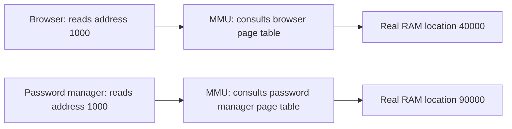

# Hardware, OS and CPU

Study notes in my own words, with the analogies we used. Each concept has "In my words" (how I explained it) and "Precise version" (the corrections).

---

## 1. Three layers

**In my words:** Hardware at the bottom, the OS on top of it, and applications on top of the OS. Every application needs memory, CPU time, and sometimes the GPU. The OS manages all of it.

**Precise version:**
- The OS is never idle. From the moment it boots, it runs system daemons (systemd, logging, time sync, networking, filesystem management). Each has its own threads and gets CPU time like everything else.
- Even a fresh Ubuntu Server with nothing installed is already a small ecosystem of daemons.

---

## 2. What a CPU does

- It fetches an instruction, decodes it, executes it, and repeats. That is all.
- It has no idea what a program, a file or the internet is.
- The OS exists so that many programs can share this one dumb executor safely.

---

## 3. Logical cores and hyperthreading

**Analogy:** one chef, two dishes. While dish A's water boils, the chef starts chopping for dish B. It is the same chef with the same hands, but less idle standing around. Over a shift, more dishes get finished. It is not two chefs.

**In my words:** Hyperthreading is a way of presenting double the logical cores. Underneath, it is not double the work. It makes the existing hardware work more efficiently.

**Precise version:**
- A physical core often has idle internal circuitry (waiting for memory, waiting on a previous result). Hyperthreading (SMT) lets a second thread's instructions fill those gaps.
- Real gain is about 15 to 30%, not 100%, because both logical cores share the same execution units.
- The 2x multiplier only applies when SMT exists. Many ARM chips and some efficiency cores have none.
- Example: an 8 core server with hyperthreading shows 16 logical cores. Exactly 16 threads truly execute at any single instant, across all applications combined.
- There is no fixed thread ceiling like "16,000 threads". Thousands of threads can exist. Only as many run as there are logical cores. The rest are parked by the OS.

---

## 4. Time slicing (preemptive multitasking)

**Analogy:** a grocery store with a few checkout counters.
- Counters are logical cores.
- Shoppers are threads.
- The store manager is the OS scheduler.
- Only as many shoppers are served at once as there are counters.
- Every few milliseconds the manager pulls a shopper aside, mid transaction if needed, and the next waiting shopper steps up. Because it happens thousands of times a second, everyone feels served continuously.

**In my words:** If applications were trusted to hand the CPU back politely, one application could be a bad program or a malicious one that never lets go, and it would hang the whole system like a zombie. So the OS enforces the time slicing itself. No single application can hold the entire system.

**Precise version:**
- The hardware timer interrupt forces the switch. It happens whether the running program agrees or not (an alarm clock that rings no matter what).
- A time slice is milliseconds, which is millions of nanoseconds. Within one slice, thousands to millions of instructions execute.
- 16 threads run at once on 16 logical cores. It is not "one application at a time" machine wide.
- 100% CPU utilization means all logical cores are constantly busy back to back. It does not mean a thread limit was exceeded.

```
Logical core 1:  [ Thread A ][ Thread D ][ Thread A ][ Thread F ] ...
Logical core 2:  [ Thread B ][ Thread E ][ Thread C ][ Thread B ] ...
                 |<- slice ->|
                 each slice is a few milliseconds, then the OS switches
```

---

## 5. Clock speed and overclocking

**In my words:** 3.2 GHz is how many times per second the transistors tick on and off.

**Precise version:**
- 3.2 GHz means 3.2 billion ticks per second. Each tick drives a small step of work.
- Faster ticking means more transistor switching, so more heat and more voltage.
- Manufacturers pick a rated speed with a safety margin.
- Overclocking tells the chip to tick faster than rated. More raw speed, but it needs better cooling, draws more power and risks instability. The chip throttles itself back down when it gets too hot.
- Hyperthreading and overclocking are independent levers that stack. Hyperthreading fills idle gaps. Overclocking speeds up the ticks themselves.

---

## 6. Virtual memory and the MMU

**Analogy:** a hotel. Every guest is told "you are in room 1". The front desk (the MMU) quietly keeps a private lookup card for each guest and sends each one to a different real room. No guest can wander into another guest's room, because they cannot even express that room's real number.

**In my words:** Every application has its own page table, living in RAM. The page table holds memory addresses starting from zero for that application, and each one points to the real physical location. The MMU is the traffic police. It routes each memory access to the right place. When an application dies, its page table and memory are freed.

**Precise version:**
- Two problems it solves: isolation between processes, and simplicity for programmers (no need to know real physical addresses).
- Each process has its own page table, built and maintained by the OS and stored in ordinary RAM. The MMU is hardware next to the CPU. It consults the process's page table on every memory access. It is the lookup engine, not the filing cabinet.
- Page tables have nothing to do with IP addresses. That was a networking concept I mixed in.
- Two different protections: the timer interrupt stops a program from hogging CPU time. Virtual memory stops a program from reading another program's memory.



---

## 7. User space vs kernel space

- Applications run in user space. The OS kernel runs in kernel space.
- Together with time slicing and virtual memory, this is how one machine safely runs many programs.
- Still to learn: system calls, the mechanism an application uses to ask the kernel to do something privileged (open a file, send a packet).

---

## 8. Servers and clients

**In my words:** A server is a process that is running and waiting for a command to respond to. A client is the one that calls a server to get data. There are two meanings of "server": the physical machine (hardware), and a software process. One physical machine can run many software servers at once.

**Precise version:**
- "Accessible over the internet" is a separate, later layer. A server running on an offline laptop is still a server.
- Postgres on my home server is a server. My Mac calling an API is a client.
- Drop the "publish it" part. A client's job ends when it gets the response back.
- My home lab: one physical machine, with software servers like Postgres, an SSH daemon, and K3s components.

---

## 9. Containers vs virtual machines

**In my words:** Containers (Docker, LXC) use the host kernel. They have no OS of their own. A hypervisor like KVM lets an application run with its own complete OS. Proxmox is a platform to manage that.

**Precise version:**
- Containers share the host kernel. Isolation comes from two Linux features:
  - **namespaces**: each container gets its own view of processes, filesystem and network (the same spirit as a page table giving each process its own view of memory)
  - **cgroups**: caps on how much CPU, memory and other resources a container may use
- Containers are lightweight, because no second kernel boots.
- Virtual machines each run their own full kernel. Heavier and slower to start, but much stronger isolation.
- **KVM** (kernel based virtual machine) is a feature built into the Linux kernel that turns Linux into a hypervisor. It uses CPU hardware support (Intel VT-x, AMD-V) so VMs run near native speed. It is not the keyboard, video, mouse switch box.
- **Proxmox** is a management platform on top of KVM (for full VMs) and LXC (for containers). It is more than a UI: it also handles storage, networking, backups and clustering. But KVM is the actual hypervisor.
- **Analogy:** KVM builds fully separate apartments inside one building. Each one has its own plumbing and wiring and thinks it is the only building.

```
Containers                          Virtual machines (KVM)
+--------+ +--------+ +--------+    +--------+ +--------+
| App A  | | App B  | | App C  |    | App A  | | App B  |
+--------+ +--------+ +--------+    | Guest  | | Guest  |
|   Shared host kernel         |    | kernel | | kernel |
+------------------------------+    +--------+ +--------+
|          Hardware            |    | Hypervisor (KVM)   |
+------------------------------+    |      Hardware      |
                                    +--------------------+
```

---

## 10. My server setup

- Wiped laptop, Ubuntu Server 24.04.5 LTS, with Tailscale and SSH installed as system daemons.
- Connect from the Mac over Tailscale with key based SSH (no password). The mechanism is in `networking.md`, section 10.

---

## 11. My stitched summary (the whole picture)

Multiple applications run on top of a single OS. The OS isolates memory through the MMU and per process page tables, and it shares the CPU through time slicing. On an 8 core machine with hyperthreading, 16 logical cores run 16 threads at any instant, each for a slice of milliseconds, with thousands to millions of instructions per slice. The clock speed says how fast the ticks happen inside that.

---

## 12. Still to cover

- System calls and the user space to kernel boundary (highest value next)
- Interrupts beyond the timer (network packets, disk completion)
- Storage and I/O: why disk is so much slower than RAM
- The boot process (UEFI, bootloader, kernel initialization)

(The write ahead log and ACID from the start of the database session will go in a separate databases file later.)
