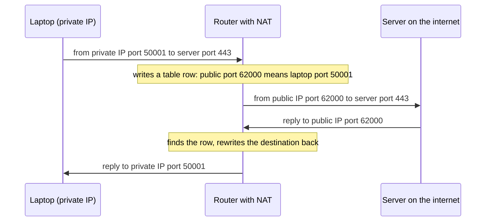
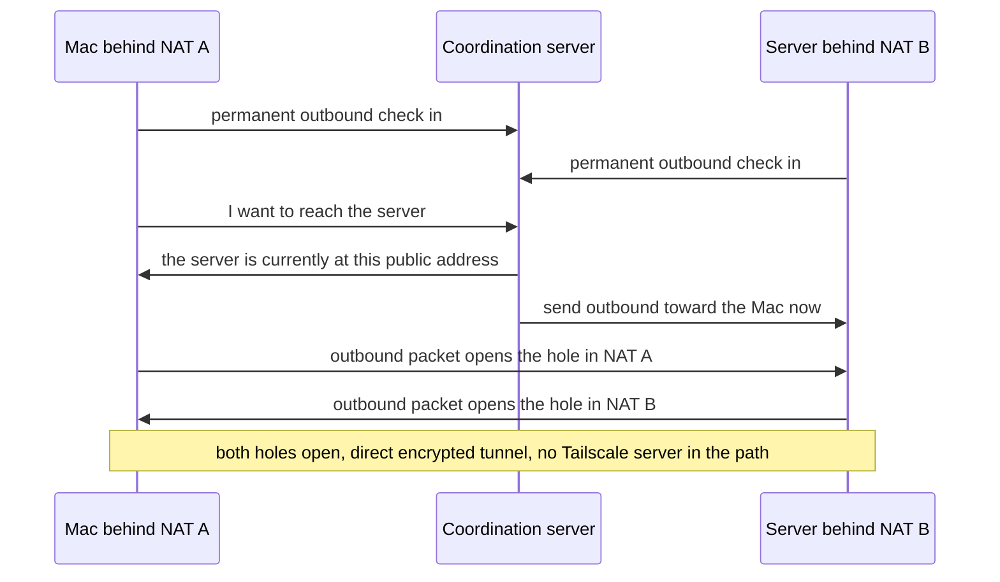
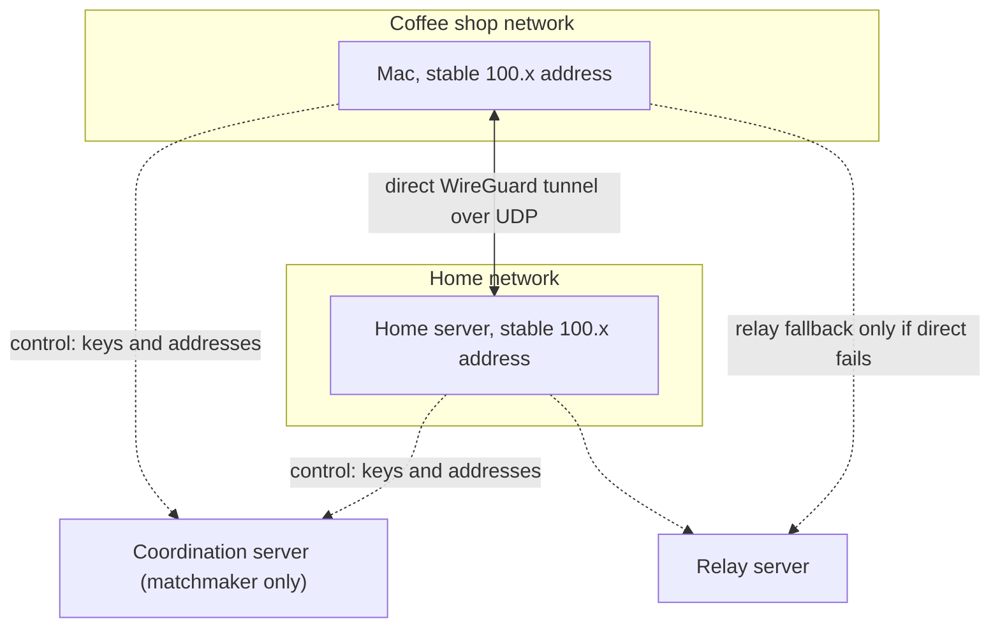
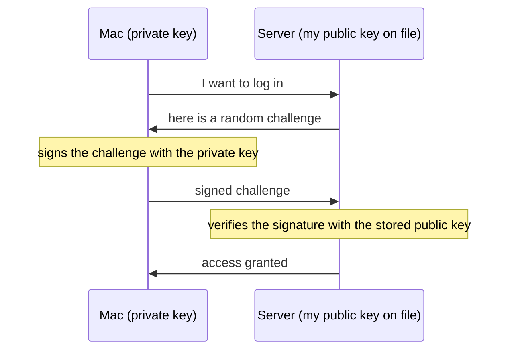
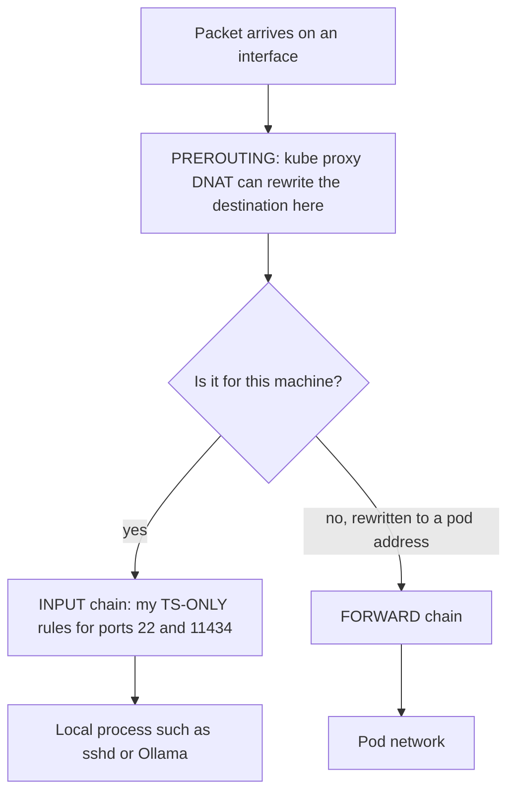
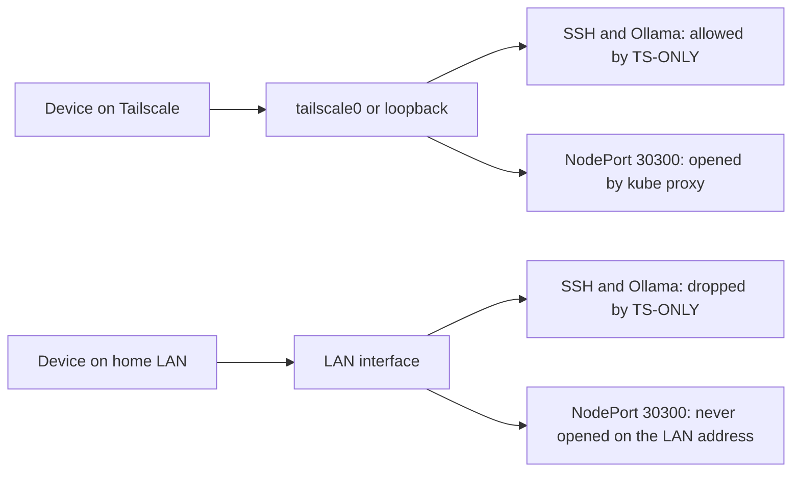
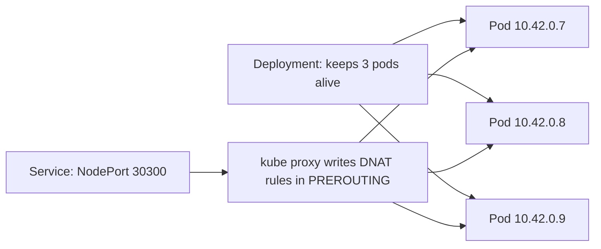

# Networking

Study notes in my own words, with the analogies we used and a few diagrams. Each concept has "In my words" (how I explained it), "Precise version" (the corrections that made it interview ready), and where it helps, an analogy and a diagram.

Diagrams use Mermaid. They render on GitHub and in most markdown viewers.

---

## 1. Layers and encapsulation

**In my words:** Data goes down through layers on the sender, and each layer wraps the data in its own header. On the way back up, each layer unwraps its own header. Routers in the middle only open the IP envelope. They never look inside.

**Precise version:**
- OSI has 7 layers, TCP/IP collapses them to 4. In practice people talk in OSI numbers (L2 link, L3 IP, L4 TCP/UDP, L7 application).
- Encapsulation: application data goes inside a TCP or UDP segment, which goes inside an IP packet, which goes inside a link layer frame.
- A router reads the IP header to decide the next hop. A switch reads the MAC header. Neither needs the payload.

```
+-----------------------------------------------+
| Frame header (MAC addresses)                  |
|  +-----------------------------------------+  |
|  | IP header (source IP, destination IP)   |  |
|  |  +-----------------------------------+  |  |
|  |  | TCP or UDP header (ports)         |  |  |
|  |  |  +-----------------------------+  |  |  |
|  |  |  | Application data (HTTP...)  |  |  |  |
|  |  |  +-----------------------------+  |  |  |
|  |  +-----------------------------------+  |  |
|  +-----------------------------------------+  |
+-----------------------------------------------+
```

---

## 2. DNS

**In my words:** DNS turns a name into an IP. A resolver does the legwork: it asks the root, then the TLD server, then the authoritative server for the domain.

**Precise version:**
- Hierarchy: root, then TLD (.com), then the authoritative server for the domain.
- Resolvers cache answers for the TTL the record allows.
- Status: I deliberately skipped the deep dive. Still to do: a full resolution walkthrough with caching and TTLs.

---

## 3. TCP vs UDP

**In my words:** TCP is a pipe. You set it up with a handshake, and then bytes go in one end and come out the other end in order. UDP has no handshake and no memory. It just labels a packet with source and destination ports and sends it.

**Precise version:**
- TCP: handshake, sequence numbers, acknowledgements, retransmission, flow control, congestion control. Minimum header is 20 bytes (not 16).
- TCP is a byte stream, not a message stream. The application must define its own message boundaries.
- UDP: 8 byte header, no connection, no state. UDP does not "open" anything. Delivery goes by destination IP and port.
- UDP use cases: live voice and video (stale data is useless), game servers, DNS (one packet each way), high volume metrics like StatsD, and QUIC (which builds its own reliability on top).
- **Key takeaway:** developers do not pick TCP or UDP directly. They pick the application protocol (HTTP, Postgres wire protocol, gRPC, DNS) and the transport comes bundled.
- TCP failure modes: connection exhaustion, half open connections, head of line blocking, timeout mismatch.

### Postgres connection exhaustion (same shape as NAT port exhaustion)
- `max_connections` is a hard wall. Each connection is an OS process on the database side.
- More application pods means more connections. Adding pods can make an overload worse.
- Fix pattern: pool and reuse connections, cap the pool per pod.

---

## 4. HTTP/2, QUIC and HTTP/3

**In my words:** HTTP/2 multiplexes many requests over one TCP connection, but TCP still delivers strictly in order. One lost packet stalls every stream. QUIC fixes this by building reliability per stream on top of UDP, so one lost packet only stalls its own stream.

**Precise version:**
- HTTPS vs HTTP/3 is not one axis. HTTPS means "encrypted with TLS". HTTP/3 is a version of HTTP that runs over QUIC.
- QUIC bonuses: a 1 RTT handshake (TLS and connection setup merged), and a connection ID that survives network changes (wifi to cellular).
- Still to learn: actual frame mechanics of HTTP/2 and HTTP/3.

---

## 5. TLS

**In my words:** The server shows a certificate. A certificate authority I already trust has signed it, so I know I am talking to the real server. Then both sides agree on a session key and encrypt everything with it.

**Precise version:**
- Modern TLS does not encrypt the session key with the server's public key. It uses an ephemeral Diffie Hellman exchange for the session key, which gives forward secrecy: stealing the server's long term key later does not decrypt old recordings.
- The certificate proves identity. Diffie Hellman creates the shared secret. These are two separate jobs.

---

## 6. IP addressing and subnets

**Analogy:** an IP address is a street plus a house number. The network part is the street. The host part is the house.

**In my words:** In CIDR, the slash number says how many bits are the street. A bigger slash number means a smaller network.

**Precise version:**
- /24 gives 254 usable hosts. /16 gives about 65,000 hosts.
- Private ranges: 10.0.0.0/8, 172.16.0.0/12 (172.16 to 172.31), 192.168.0.0/16.
- They exist because there are not enough public IPv4 addresses. Public routers drop private addresses, so every home and office can reuse them with no conflict.

---

## 7. NAT

**Analogy:** a doorman. The doorman only lets someone in if a resident went out to meet them first. Strangers who knock first get turned away.

**In my words:** My laptop has a private IP. When it talks to the internet, the router rewrites the source to its single public IP and writes a row in a table. When the reply comes back, the router looks up the row and rewrites it back. The private IP identifies the device. The port identifies the conversation. My ISP (Verizon) gives me one public IP for the whole house.



**Precise version:**
- Outbound traffic creates the row that permits the reply. An unsolicited inbound packet has no row, so it is dropped by definition.
- One public IP is shared through ports. Each conversation gets its own source port, not each device.
- **Port exhaustion in the cloud:** each NAT gateway has a finite pool of about 65,000 ports per destination (public IP + port + destination IP + port). Closed connections sit in TIME_WAIT for minutes and keep holding ports. A retry storm (Black Friday) can drain the pool.
- Fixes: more public IPs or NAT gateways (one per availability zone), connection reuse, and no blind retries.
- This is structurally the same problem as Postgres connection exhaustion: a finite pool, hit by a burst, made worse by retries.

---

## 8. Local network: MAC and ARP

**In my words:** A MAC address is the permanent hardware ID of a network card. An IP address is assigned by whatever network I join. On a local network, wifi delivers frames to a MAC, not an IP. To find the MAC for an IP, a device broadcasts "who has this IP?" (ARP), the owner replies with its MAC, and everyone caches the answer.

**Precise version:**
- Printer example: I know the printer's IP, but the frame needs its MAC. ARP broadcast, printer replies, MAC is cached, then direct delivery.
- Delivery on the same subnet skips routing, but it does not skip the TCP handshake.
- Casting (TV, Chromecast) is a discovery and announcement layer on top of the same local mechanisms.
- The MAC travels with the device between networks. The private IP is reassigned per network.
- Modern devices randomize the MAC per network by default, so networks cannot track a phone across locations.

---

## 9. Tailscale and NAT hole punching

**Analogy:** two houses, each with a doorman who only admits guests the resident has gone out to meet. If both residents step outside toward each other at the same moment, each one opens their own door's return path, and the two meet in the middle.

**The problem:** a Mac at a coffee shop and a server at home are each behind a separate, unrelated NAT. Neither can reach the other, because neither NAT accepts unsolicited inbound traffic.

**In my words:** Tailscale gives every device a stable private 100.x address that never changes, no matter how its real address changes. Every device keeps a permanent outbound connection to Tailscale's coordination server. The coordination server is a matchmaker, not a post office. It never carries my data. It only tells each side where the other currently is, and it nudges the peer to send traffic too. Then both sides send outbound at the same moment, both NAT holes open, and traffic flows directly, encrypted.

My one line summary: Tailscale lets two devices behind separate NATs, which would normally never reach each other, find each other and talk directly as if on the same private network, wherever they are. It makes NAT stop being a wall between my own devices.



**Precise version (the corrections that mattered):**
- The check in connection is symmetric. Every device has it, not just the server.
- Each side's own outbound packet opens that side's own NAT hole. The coordination server cannot open holes. It can only cause the peer to act.
- Bidirectional: any device can be nudged. In practice only the server is reached because only it runs an SSH daemon.
- NAT entries expire (UDP about 30 seconds, TCP minutes). Tailscale sends periodic keepalives. That is Tailscale's job, not SSH's.
- Relay fallback: with very strict (symmetric) NATs, hole punching fails and Tailscale relays through its own servers. Still end to end encrypted, just slower. Direct is always preferred.
- Postgres inside my cluster uses the in cluster K3s DNS name for app to database traffic, not the Tailscale hostname. That is correct, because it avoids a pointless detour. A Postgres connection string is `postgres://`, not `https://`.
- Other uses: internal tools with no public exposure, VPN replacement, one flat network across cloud, office and home, scoped contractor access, and no public attack surface at all.



---

## 10. WireGuard, Diffie Hellman and key based identity

**In my words:** WireGuard has one job: encrypt a tunnel between two endpoints whose public keys I already have. It does no matchmaking and no NAT punching. Tailscale wraps WireGuard and does all the orchestration for me.

**WireGuard runs over UDP, and my traffic runs inside it.** The tunnel is UDP. TCP (my SSH) runs inside it. WireGuard avoids TCP over TCP on purpose, for the same head of line blocking reason as QUIC.

```
+------------------------------------------------+
| UDP packet (the tunnel, WireGuard)             |
|  +------------------------------------------+  |
|  | Encrypted payload                        |  |
|  |  +------------------------------------+  |  |
|  |  | My SSH session (TCP)               |  |  |
|  |  +------------------------------------+  |  |
|  +------------------------------------------+  |
+------------------------------------------------+
```

### Two different jobs for key pairs
1. **Key agreement (Diffie Hellman).** Temporary, ephemeral keys. Purpose: both sides end up with the same shared secret, so the pipe is encrypted and eavesdroppers see only ciphertext.
2. **Identity (authentication).** A permanent key pair, for proving who I am (my SSH key, my GitHub key).

**Diffie Hellman in my words:** each side has a private key that is never shared and a public key that is shared openly. Combining my private key with your public key gives the same shared secret you get from combining your private key with my public key. The math is elliptic curve (or modular exponentiation), not ordinary arithmetic. I accept that as a given and do not need to derive it.

(The paint mixing analogy for Diffie Hellman led me astray, because I confused "public" with "secret". The keys only framing above is the clean version.)

**WireGuard tunnel sequence:**
1. One time, out of band: public keys are exchanged (Tailscale automates this through the coordination server).
2. Each session independently derives a shared secret with Diffie Hellman.
3. All packets are encrypted with that secret.
4. Long sessions periodically re negotiate fresh ephemeral keys, for defense in depth.

### SSH key login (identity)
My Mac holds the private key. The server holds the matching public key in its authorized keys. The private key never travels, not even encrypted. Only proof that I own it travels, and that proof is useless on replay.



- Same pattern for GitHub: GitHub only verifies my signature against the public key it has on file. It never sends me anything private.
- Separately, GitHub proves its own identity to me through its TLS certificate (the mechanism from section 5).
- A password travels and can be reused if stolen. A signed challenge is worthless once used, because the server never issues the same challenge twice.

---

## 11. Firewalls and netfilter

**In my words:** The standard model is default drop, then an allow list. My own setup allows Tailscale traffic and loopback, and drops everything else.

**Precise version:**
- netfilter is the actual Linux kernel mechanism. ufw, firewalld and iptables are just interfaces to it. It is Linux specific (Windows has Windows Filtering Platform, macOS has pf).
- Docker, K3s and my own rules all write rules into the same netfilter, in different chains.
- Rules are evaluated top to bottom and stop at the first match. That is why a broad DROP must sit below a specific ALLOW, and why my rule is inserted at the top of INPUT.
- Ingress is inbound traffic. Egress is outbound traffic from the application itself.
- A host firewall only governs the host's own network interface. Docker and K3s install their own forwarding rules past that front door. They are not an extension of my host rule set.
- Packet path: PREROUTING happens first (before the kernel decides whether the packet is for this machine). INPUT comes later, only for packets destined for a local process.



---

## 12. My home lab network (the real setup)

Files in my Tecurious-Infra repo: `firewall-block-nodeports.sh` (installer), `tailscale-only.service` (systemd unit) and `k3s-config.yaml`.

### Gate one: host ports (INPUT chain)
- A systemd oneshot service builds a `TS-ONLY` chain. It returns (allows) traffic on `lo` and `tailscale0`, and drops everything else.
- It matches only TCP ports 22 (SSH) and 11434 (Ollama), and is jumped to from INPUT with `-I` so it is evaluated first.
- A `.service` file is just systemd's naming convention. It is not a Kubernetes Service. systemd loads it at every boot, and netfilter simply holds the resulting rules.
- Break glass: `sudo systemctl stop tailscale-only` opens SSH and Ollama on every interface if Tailscale breaks and I need physical access.
- `netfilter-persistent` is disabled on purpose: it snapshots all host rules, including Docker, K3s and Tailscale chains that do not exist yet at boot, so the restore aborts.

### Gate two: NodePorts (kube proxy)
- `kube-proxy-arg: nodeport-addresses=100.64.0.0/10,127.0.0.0/8` in `/etc/rancher/k3s/config.yaml`.
- kube proxy handles NodePort traffic with DNAT in PREROUTING, before INPUT. So an INPUT drop rule can never see it.
- The fix is at the source: kube proxy only opens NodePorts on Tailscale addresses and loopback. On the LAN address, nothing is listening, so it is not blocked, it is never opened.
- 127.0.0.0/8 stays because `tailscale serve` proxies to 127.0.0.1:30300 and :31322.

**The important correction:** it is not one gate with one allow list. It is two independent gates for two different traffic paths. Before the NodePort fix, any device on my home LAN could reach NodePort 30300, because my INPUT rule only ever watched ports 22 and 11434.



### Verification
From a non Tailscale device on the home wifi, `curl` the server's LAN IP on NodePort 30300. It should time out. Over Tailscale it should answer. Also check after boot: `sudo iptables -S TS-ONLY` and `sudo ip6tables -S TS-ONLY`.

### Known gaps and open checks
- Docker published ports bypass both gates (Docker's DNAT is in PREROUTING and FORWARD). Accepted risk: production runs in K3s, and Docker is only for local testing.
- `nodeport-addresses` covers NodePort services only. Traefik LoadBalancer ports (80 and 443 by default) and `hostPort` pods may still be reachable on the LAN. Check with `kubectl get svc -A`.
- Tailscale also assigns IPv6 addresses in `fd7a:115c:a1e0::/48`. The config lists IPv4 only. Probably fine on an IPv4 only single node K3s.
- 100.64.0.0/10 is the shared carrier grade NAT block and can be used by other networks too.

---

## 13. Kubernetes networking

**Deployment vs Service:**
- A Deployment says what should be running (three copies of this image) and keeps that promise. If a pod dies, it starts a replacement.
- A Service gives that shifting set of pods one stable address. Pod IPs change every time pods are recreated.

**In my words:** kube proxy keeps a ledger. For every running Service, there is already a DNAT rule sitting in PREROUTING. So when traffic hits port 30300, PREROUTING does not decide anything live. It matches a rule that was written ahead of time.

**Precise version:**
- kube proxy watches the Kubernetes API. Create a Service and a rule appears. Delete it and the rule disappears.
- With several pods behind a Service, kube proxy writes several DNAT targets with probabilities, so each new connection lands on a random pod. That is the load balancing: plain DNAT, with no separate load balancer process.



### NetworkPolicy (the Kubernetes version of my firewall)
- A raw iptables script in a container does not work well, because pod IPs change constantly. A NetworkPolicy selects pods by label (for example `app=payment-service`) and Kubernetes keeps enforcement correct as pods come and go.
- Two sections: ingress (who may send traffic in) and egress (where the pod may send traffic out).
- Same default deny mental model: once a policy selects a pod for ingress, that pod is default deny for ingress. Egress is independent. With no policy at all, everything is open.
- Egress applies to all destinations, in cluster or external. In practice it is often written loosely inside the namespace and strictly for external destinations like Stripe, but that is a deliberate choice, not automatic.
- Ingress and egress can be one YAML or two. Kubernetes merges every policy that selects a pod, additively. Small teams keep them together. Larger orgs sometimes split them (a platform team owns baseline egress, service teams own ingress).
- Example for a payment pod: ingress only from `app=gateway` on port 8080. Egress only to `app=order-service` and to the Stripe IP range on 443.

### FQDN in egress rules
- Plain NetworkPolicy takes IP blocks. FQDN rules are a CNI extension (Cilium, Calico). They resolve DNS to IPs and keep re resolving.
- Risk: if the hostname resolves to many or rotating IPs, the rule can go stale. That shows up as connection failures.
- Kafka case: "authorization for topic" errors are past the network layer. TCP connected and Kerberos worked. The broker's ACLs refused.

---

## 14. Gaps still to cover for senior interviews

- Load balancer types (L4 vs L7) and algorithms: round robin, least connections, consistent hashing
- TCP congestion control in detail
- BGP: only the shape, not the depth
- Rate limiting and backpressure at the application level
- Idempotency and delivery guarantees (at least once vs exactly once). Highest value next topic.
- CAP theorem and consistency models
- Observability: what to check first when a service degrades
- DDoS and injection attacks in the payment system context
